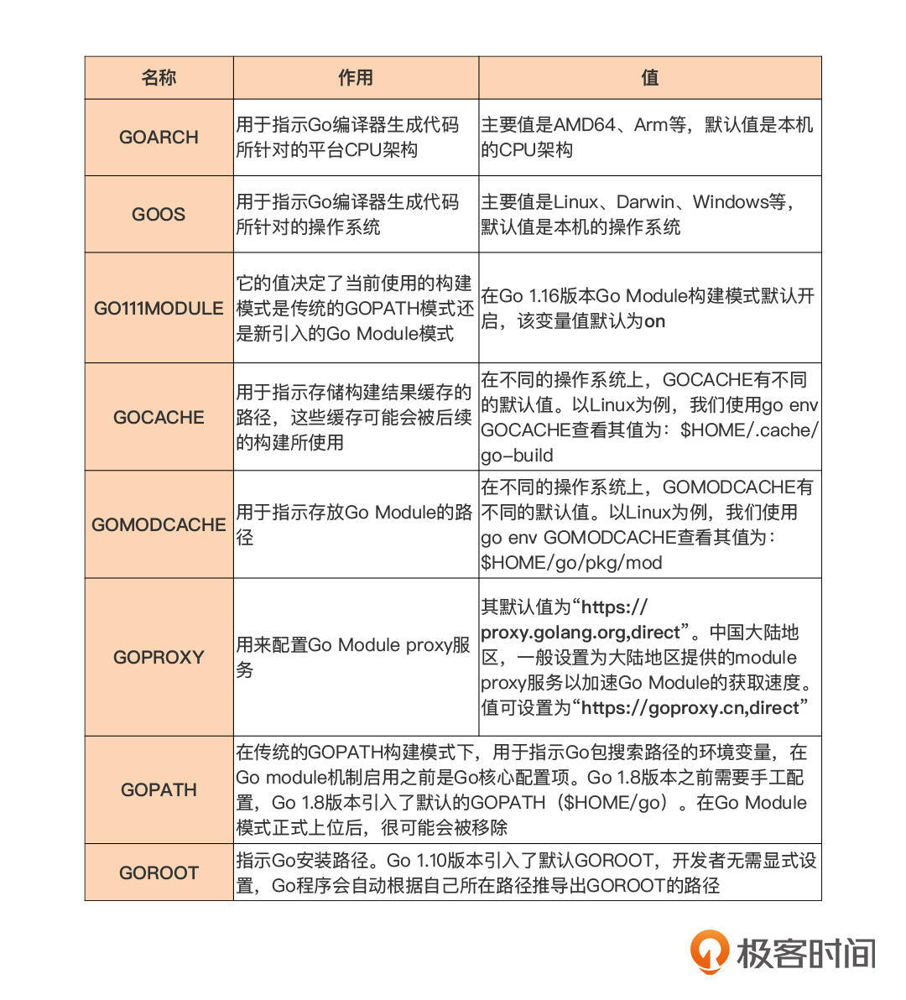
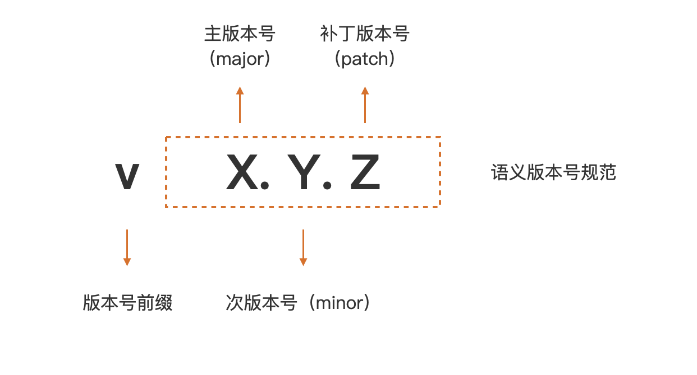
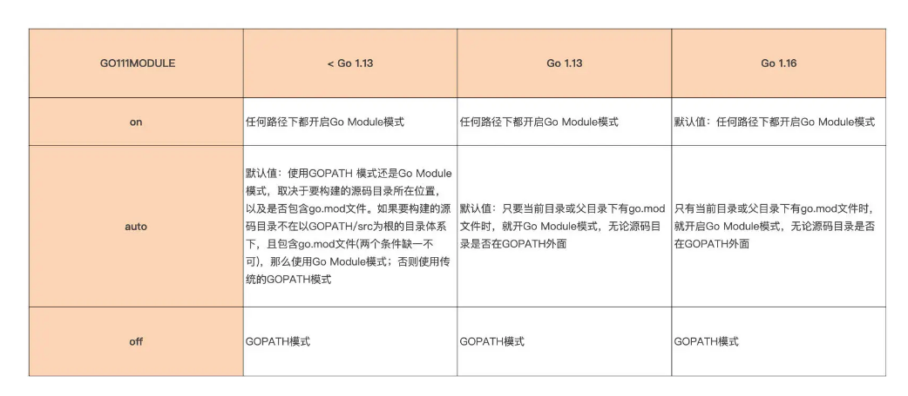

[TOC]

# 前置


## 学习理由

- 简单
- 生产力与性能
    - 云原生
- 快乐与“钱景”


## 设计哲学

`简单`，是 Go 生产力的源泉。

`显式`，是 Go 希望开发人员明确知道自己在做什么

`组合`，Go 选择采用的组合方式:

- 类型嵌入
    - 垂直组合（匹配方法名字，本质是能力继承）
    - 水平组合（能力委托）

`并发`，原生支持并发，并且采用了用户层轻量级线程，Go 将之称为 goroutine，并且在语言层面内置了辅助并发设计的原语：channel 和 select。

`面向工程`，Go 将解决工程问题作为设计原则之一

- 语法设计细节打磨
- 标准库 “自带电池”（丰富类库）
- 令其他语言开发人员羡慕的工具链
- gofmt，统一代码风格


# 入门

## 安装

直接官网安装并设置环境变量即可


### 安装多个版本

- 直接安装并切换环境变量

- go get 命令获取下载器并执行下载

  ```
  go get golang.org/dl/go1.15.13
  
  go1.15.13 download
  
  go1.15.13 version
  
  go1.15.13 env GOROOT
  ```

- go get 安装非稳定版本

  ```
  get golang.org/dl/go1.17beta1
  
  go get golang.org/dl/gotip
  ```

  

## 常用配置项


`go help environment` 可查看详情



Tips：

免费好用的国内 module proxy 服务？

```
最常用的是下面这个proxy服务：

export GOPROXY=https://goproxy.cn,direct

其他的几个proxy服务也应该都很好用：

export GOPROXY=https://goproxy.io,direct
export GOPROXY=https://mirrors.aliyun.com/goproxy,direct
export GOPROXY=https://goproxy.baidu.com,direct

以上代理除了通过环境变量配置外，还可以用go env命令写入，以阿里的module proxy为例：
$Go env -w GOPROXY=https://mirrors.aliyun.com/goproxy/
```


## 程序结构


- 源文件：lowercase.go （ 提倡小写并且不用【_】）

- 以包为单位：package main 
- 导入引用包：import "fmt" 
- 入口 main 函数：func main() {...}  
- 程序正文：fmt.Println("hello, world") 

- 编译与运行：go build main.go 
- 省略编译直接运行：go run main.go


Tips：

- Tab 缩进
- 大写开头的方法传能对包外代码可见（Exported）反过来说，小写则包内可见
- 统一使用 UTF-8 字符编码（不用纠结中文乱码问题）
- 结尾标识符为分号【;】，Go 编译会自动加上，但编写时 gofmt 格式化会自动把分号去掉


复杂项目 build 需要用到 Go module：

```
// 初始化 go.mod 文件
go mod init

// 自动更新梳理依赖（清理或下载）
go mod tidy

// 再次尝试 build
go build main.go
```


## 项目布局标准

经典布局

```
$tree -F exe-layout 
exe-layout
├── cmd/						// 可执行文件
│   ├── app1/
│   │   └── main.go
│   └── app2/
│       └── main.go
├── go.mod						// Go Module 配置文件
├── go.sum						// Go Module 的校验
├── internal/					// internal 内部包，仅可被 module 内部导入
│   ├── pkga/
│   │   └── pkg_a.go
│   └── pkgb/
│       └── pkg_b.go
├── pkg1/						// pkgN 项目自身使用的依赖库文件，可被外部引用
│   └── pkg1.go
├── pkg2/						
│   └── pkg2.go
└── vendor/						// 可选，项目本地缓存特定版本依赖包，有 go.mod 少用 vendor
```

或者 pkg 聚合（早期布局）

```
...
    ├── pkg/
    │   ├── pkg1/
    │   └── pkg2/
    └── vendor/
```


不建议多 module 项目，建议拆分，如果非要：

```
$tree multi-modules
multi-modules
├── go.mod // mainmodule
├── module1
│   └── go.mod // module1
└── module2
    └── go.mod // module2
```

官方标准布局：

```
rsc commented on 28 Apr 2021

可导入的 Go 存储库的最小标准布局实际上是：

将 LICENSE 文件放在您的根目录中
将 go.mod 文件放在您的根目录中
将 Go 代码放入您的存储库、根目录或组织成您认为合适的目录树
```


## 解决包依赖管理


有三种不同的构建模式：


### GOPATH（即将废弃）

作用：在本地 GOPATH 环境变量配置路径下寻找依赖的第三方包。

Tips：可以使用`go get`命令把缺失的依赖包下载到本地。

缺点：默认没有关注依赖包的版本，导致可能不同时间 get 到的包版本不一样。


### vendor 机制（1.5 版本引入）

作用：在特定目录`vendor`文件夹下将依赖包缓存起来。

Tips：将`vendor`文件夹一起提交到代码仓库中，可以实现可重现的构建。

缺点：必须位于本地 GOPATH 环境变量配置路径下的 src 目录下才生效。

Tips 2：gb、glide、dep 等第三方工具可实现`vendor`包自动依赖分析和管理，但也有各自的缺点。

Tips 3：即使有了 Go Module，vendor 也有适用的地方，如在不方便访问外部网络或对构建性能敏感的环境中使用，如 CI/CD 中。


### Go Module（1.11 版本引入）

作用：一个 Go Module 顶层目录下回放置一个 go.mod 文件来解决包依赖管理的问题。


go.mod 文件内容：

```
module github.com/bigwhite/module-mode 				// 声明 module 路径

go 1.16												// Go 版本指示符

require github.com/sirupsen/logrus v1.8.1			// 依赖信息
```


Q：项目所依赖的包有很多版本，Go Module 是如何选出最适合的那个版本的？


语义版本规范：



机制：

- 语义导入版本 (Semantic Import Versioning)
  - 主版本号不同的两个版本是相互不兼容的
  - 在主版本号相同的情况下，次版本号大都是向后兼容次版本号小的版本。
  - 补丁版本号也不影响兼容性
  - 规定：如果同一个包的新旧版本是兼容的，那么它们的包导入路径应该是相同的

- 最小版本选择 (Minimal Version Selection)
  - Go 会在该项目依赖项的所有版本中，选出符合项目整体要求的“最小版本”


### Go 各版本构建模式机制和切换




## Go module 常规操作


### 添加依赖

1. 代码中 import
2. go get 或 go mod tidy 命令下载依赖


### 升 / 降级依赖

- 在 module 根目录下 执行 go get 带依赖版本的命令

- 或使用 go mod edit 修改依赖版本并进行 tidy

```
go list -m -versions url 		// 查版本

go mod edit -require="github.com/sirupsen/logrus@v1.7.0"	// 手动改 go.mod 也行

go mod tidy
```


### 主版本号大于1


按照语义版本规范，在路径基础上增加版本号信息即可，其他同上，如：

```
"github.com/go-redis/redis/v7"
```


### 升级到不兼容版本


按照语义版本规范，直接改版本号即可，其他同上，如：

```
"github.com/go-redis/redis/v8"
```


### 移除依赖	

1. 移除 inport
2. 执行 go mod tidy 命令


### 特殊情况：使用 vendor


Go Module 构建模式下无需手动维护 vendor：

1. go mod vendor    // 快速建立和更新 vendor

2. go build -mod=vendor   // 1.14 及后续版本如存在 vendor 目录则自动使用这个模式，除非你手动加 -mod=mod


```
vendor
├── github.com/
│   ├── ...
└── modules.txt				// 记录了 vendor 下的 module 与 版本
```


## 入口函数与包初始化


### 初始化顺序

1. import   （深度优先，递归初始化）
2. const 常量
3. var 变量
4. init()  （可以有多个，但不能被显式调用）
5. main()  （main 包必须包含 main 函数）


Tips：

可以利用空导入，不调用依赖包，但通过依赖的 init 初始化功能，实现初始化


### init 函数的常用用途


- 重置包级变量值

- 实现对包级变量的复杂初始化

- 空导入：在 init 函数中实现“注册模式”  （工厂设计模式）


## 搞一个 Web 服务

初始化 Go Module

```shell
go mod init simple-http-server
```

会自动创建 go.mod 文件：

```
module simple-http-server

go 1.18
```

创建一个 main.go

```go
package main

import "net/http"

func main() {
	http.HandleFunc("/", func(writer http.ResponseWriter, request *http.Request) {
		writer.Write([](byte)("hello,world"))
	})
	http.ListenAndServe(":8080", nil)
}
```

run 起来后测试：

```shell
curl localhost:8080/
```


