[TOC]

# 基础


## 变量声明


### 通用变量声明方法

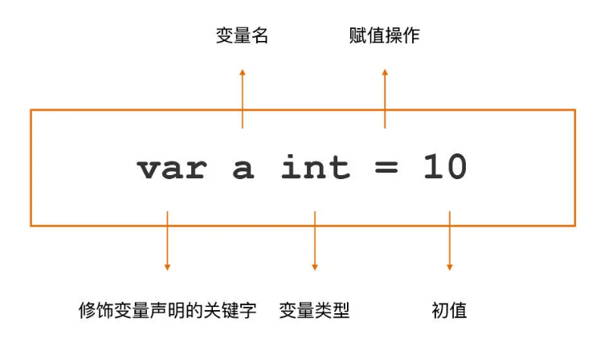

### 不赋初值的话默认零值

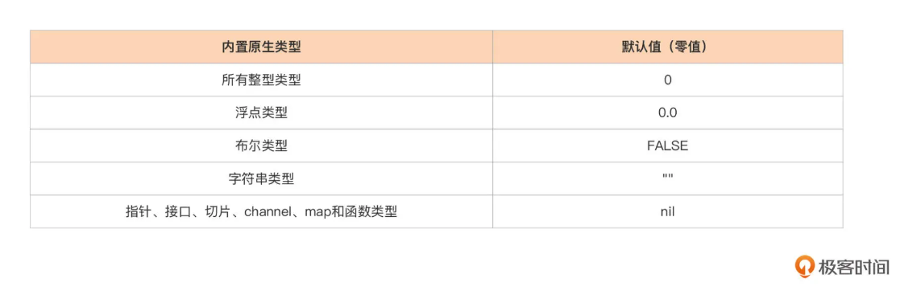

### 变量声明支持

- 变量声明块（block）

  ```go
  var ( 
  	a int = 128 
  	...
  )
  ```

- 一行声明多个变量

  ```go
  var a, b, c int = 5, 6, 7
  ```

- 以上混合

  ```go
  var ( 
  	a, b, c int = 5, 6, 7
  	c, d, e rune = 'C', 'D', 'E'
  )
  ```


### 语法糖支持

- 省略类型信息声明

  ```go
  var b = 13
  // 或者不接受默认类型，进行显示类型转型
  var b = int32(13)
  ```

- 短变量声明

  ```
  a := 12
  ```


### 包级变量的声明形式

- 推荐的方式（声明聚类与就近原则，声明一致性）

  ```go
  // 声明但延迟初始化
  var ( 
  	netGo bool 
  	netCgo bool 
  )
  // 声明并同时显式初始化（声明一致性）
  var (
  	a = 13
  	b = int32(17)
  	f = float32(3.14)
  )
  ```

### 局部变量的声明形式

- 推荐的方式

  ```go
  // 延迟初始化（采用通用声明）
  var err error
  // 显式初始化（采用短变量）
  a := 17
  f := 3.14
  // 不接受默认类型（采用短变量）
  a := int32(17)
  f := float32(3.14)
  // 分支控制（采用短变量）
  for _, c := range chars {...}
  ```

### 总结

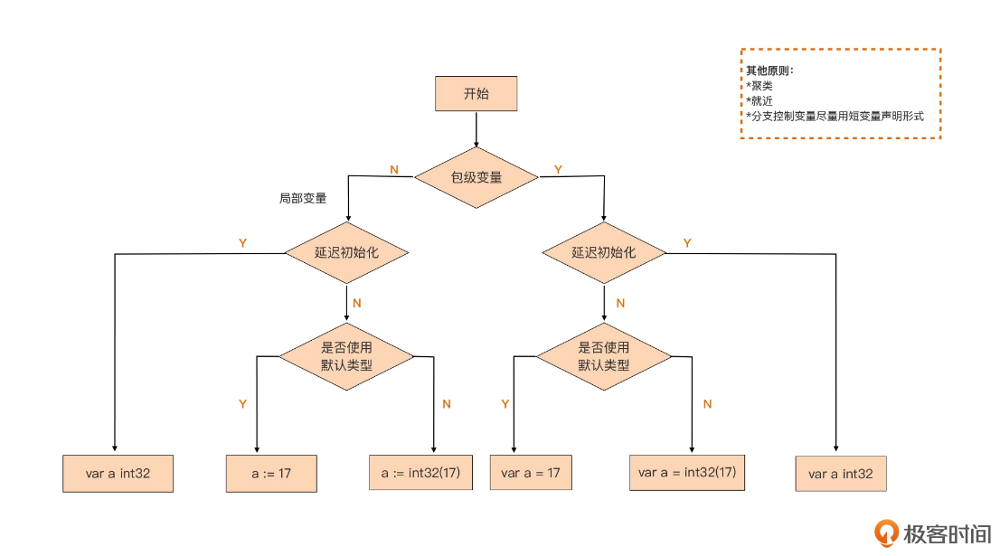


## 代码块与作用域


### 代码块与隐式代码块

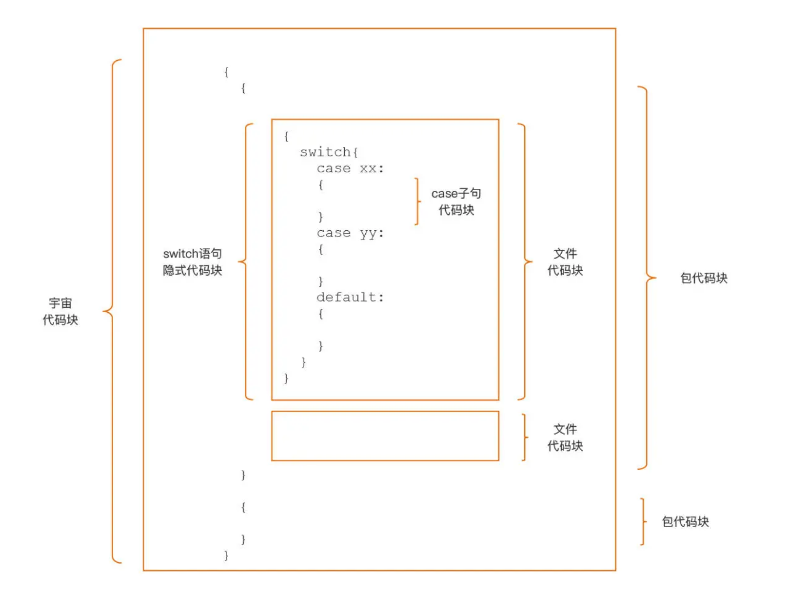


### 预定义标识符（宇宙隐式代码块的标识符）

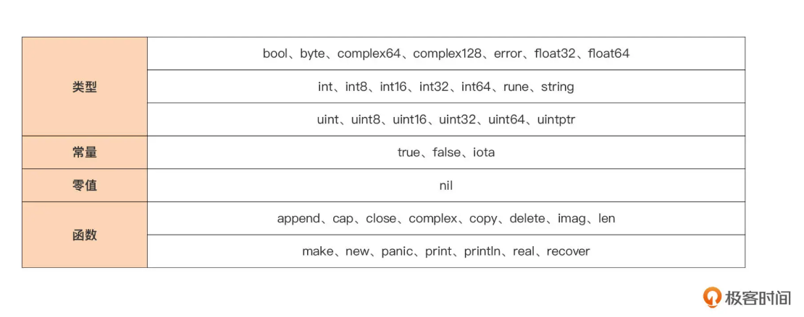

### 包级标识符

- 包顶层声明中的常量、类型、变量或函数（不包括方法）

### 文件代码块标识符

- 导入的包名

### 函数 / 方法体中

- 大括号作为范围界定


tips：控制语句隐式代码块：

```go
// 隐式
if a := 1; false { 
	
} else if b := 2; false {
	
}

// 转换成显式

{ // 等价于第一个if的隐式代码块
    a := 1 // 变量a作用域始于此
    if false {

    } else {
        { // 等价于第一个else if的隐式代码块
            b := 2 // 变量b的作用域始于此
            if false {

            }
            // 变量b的作用域终止于此
        }
    }
    // 变量a作用域终止于此
}
```


### 避免变量遮蔽的原则


可能出现的问题：

- 遮蔽预定义标识符
- 遮蔽包代码块中的变量
- 遮蔽外层显式代码块中的变量


tips：短变量声明与控制语句的结合十分容易导致变量遮蔽问题，并且很不容易识别

可以利用工具**辅助**检测变量遮蔽问题，例如`go vet`


## 基本数据类型


### 整型


#### 平台无关整形

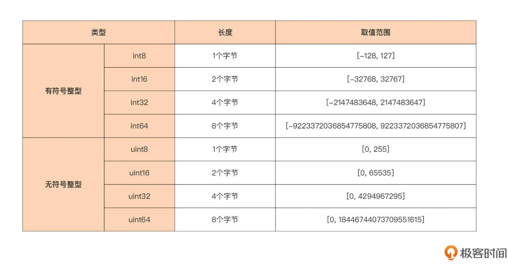

> go 采用2的补码作为整形的比特位编码方法
>
> 


#### 平台相关整形

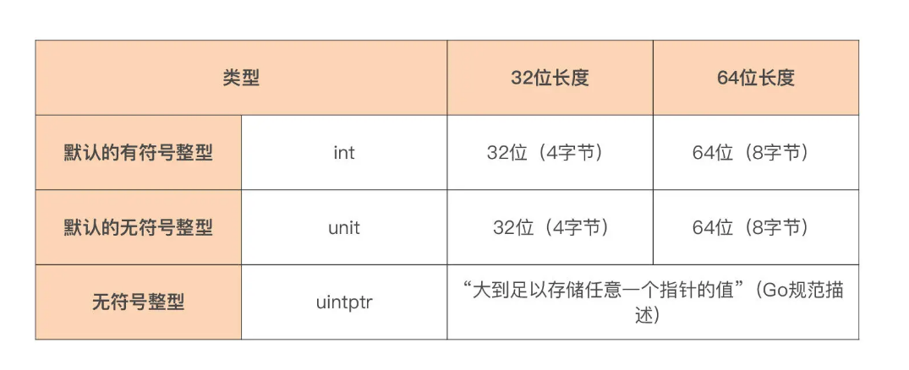


#### 整型的溢出问题

```go
var s int8 = 127
s += 1 // 预期128，实际结果-128

var u uint8 = 1
u -= 2 // 预期-1，实际结果255
```

tips：容易发生在循环语句的结束条件判定


#### 字面值与格式化输出

早期版本

```go
a := 53        // 十进制
b := 0700      // 八进制，以"0"为前缀
c1 := 0xaabbcc // 十六进制，以"0x"为前缀
c2 := 0Xddeeff // 十六进制，以"0X"为前缀
```

1.13 增加

```go
d1 := 0b10000001 // 二进制，以"0b"为前缀
d2 := 0B10000001 // 二进制，以"0B"为前缀
e1 := 0o700      // 八进制，以"0o"为前缀
e2 := 0O700      // 八进制，以"0O"为前缀

// 数字分隔符
a := 5_3_7		// 十进制: 537
```

标准库 fmt 包

```go
var a int8 = 59
fmt.Printf("%b\n", a) //输出二进制：111011
fmt.Printf("%d\n", a) //输出十进制：59
fmt.Printf("%o\n", a) //输出八进制：73
fmt.Printf("%O\n", a) //输出八进制(带0o前缀)：0o73
fmt.Printf("%x\n", a) //输出十六进制(小写)：3b
fmt.Printf("%X\n", a) //输出十六进制(大写)：3B
```


### 浮点型

#### 平台无关

- float32
- float64

#### 二进制表示

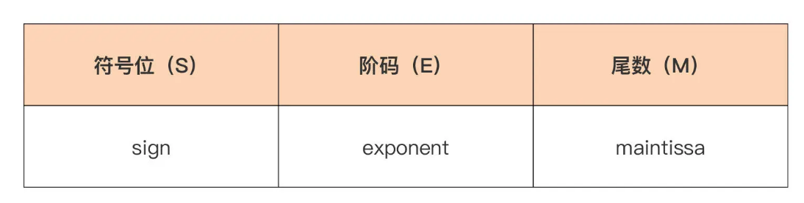

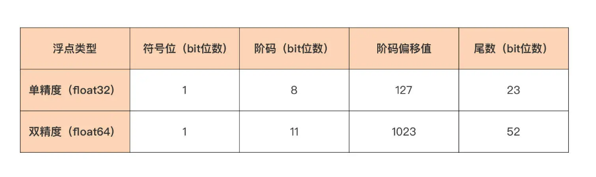

#### 转换成二进制例子

```go
有一个整数：139.8125

1.分别把整数部分和小数部分转换成二进制形式：
	整数部分：139d => 10001011b
	小数部分：0.8125d => 0.1101b（乘 2 取整）
	139.8125d=10001011.1101b
2.移动小数点直到只有一个1
	10001011.1101b => 1.00010111101b 
	移动了7位（指数7），尾数为00010111101b
3.计算阶码
	转换过程：阶码 = 指数 + 偏移值
	(偏移值计算：2^(e-1)-1，e=阶码部分的 bit 位数)
	阶码 = 7 + 127 = 134d = 10000110b
4.各自归位（见下图），得到最终二进制表示
	（尾数位数不足 23 位，可在后面补 0）
	最终浮点数 139.8125d 的二进制表示就为：
	0b_0_10000110_00010111101_000000000000
```

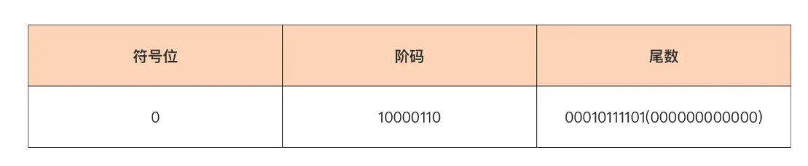


#### 字面值与格式化输出

字面值

```go
3.1415
.15  // 整数部分如果为0，整数部分可以省略不写
81.80
82. // 小数部分如果为0，小数点后的0可以省略不写

// 十进制科学计数法（e底数为10）
6674.28e-2 // 6674.28 * 10^(-2) = 66.742800
.12345E+5  // 0.12345 * 10^5 = 12345.000000

// 十六进制科学计数法（p底数为2）
0x2.p10  // 2.0 * 2^10 = 2048.000000
0x1.Fp+0 // 1.9375 * 2^0 = 1.937500
```

格式化输出

```go
fmt.Printf("%e\n", f) // 1.234568e+02		十进制科学计数法
fmt.Printf("%x\n", f) // 0x1.edd3be22e5de1p+06	十六进制科学计数法
```


### 复数类型

#### 平台无关

- complex64（实虚都为float32）
- complex128（实虚都为float64）

#### 字面值与格式化输出

```go
// 通过复数字面值初始化
var c = 5 + 6i
var d = 0o123 + .12345E+5i // 83+12345i

// complex 函数
var c = complex(5, 6) // 5 + 6i
var d = complex(0o123, .12345E+5) // 83+12345i

// 预定义函数 real 和 imag
var c = complex(5, 6) // 5 + 6i
r := real(c) // 5.000000
i := imag(c) // 6.000000
```

格式化输出：参考 float


### 自定义数值类型

#### type 关键字

基于原生数值类型

```go
// 例子：
type MyInt int32

// 类型安全规则
var m int = 5
var n int32 = 6
var a MyInt = m // 错误：在赋值中不能将m（int类型）作为MyInt类型使用
var a MyInt = n // 错误：在赋值中不能将n（int32类型）作为MyInt类型使用

// 显示转型解决上面问题
var m int = 5
var n int32 = 6
var a MyInt = MyInt(m) // ok
var a MyInt = MyInt(n) // ok
```

#### 类型别名（初衷是重构）

与type关键字可以互相替换

```go
type MyInt = int32

var n int32 = 6
var a MyInt = n // ok
```


tips：

开发生产中尽量不用浮点

tips2：

```go
// 容易混淆：
type MyInt int32	// 自定义新类型 MyInt
type MyInt = int32	// 与 int32 完全等价，可以直接相互赋值和运算
```


### 字符串类型


> 非原生问题：需要注意类型安全、防止缓冲区溢出、同步问题、获取长度代价大、非ASCII字符支持


自带原生字符串类型：string


优点：

- 数据不可变，提升并发安全性与存储利用率
- 获取长度时间复杂度为常数级
- 所见即所得（不会进行转义）
- 默认采用 Unicode 字符集，UTF-8 编码


字节序列

```go
var s = "中国人"
fmt.Printf("the length of s = %d\n", len(s)) // 9

for i := 0; i < len(s); i++ {
  fmt.Printf("0x%x ", s[i]) // 0xe4 0xb8 0xad 0xe5 0x9b 0xbd 0xe4 0xba 0xba
}
fmt.Printf("\n")
```

字符序列   （Unicode 字符集的码点）

```go
var s = "中国人"
fmt.Println("the character count in s is", utf8.RuneCountInString(s)) // 3

for _, c := range s {
  fmt.Printf("0x%x ", c) // 0x4e2d 0x56fd 0x4eba
}
fmt.Printf("\n")
```


#### rune 类型与字符字面值

一个 rune 示例相当于一个 Unicode 字符，等价于 int32 类型

```go
// 字面值
'a'  // ASCII字符
'中' // Unicode字符集中的中文字符
'\n' // 换行字符
'\'' // 单引号字符

// Unicode 专用转义字符\u 或\U 作为前缀
'\u4e2d'     // 字符：中
'\U00004e2d' // 字符：中
'\u0027'     // 单引号字符

// 本质是整型数
'\x27'  // 使用十六进制表示的单引号字符
'\047'  // 使用八进制表示的单引号字符
```


#### 字符串字面值

```go
"abc\n"
"中国人"
"\u4e2d\u56fd\u4eba" // 中国人
"\U00004e2d\U000056fd\U00004eba" // 中国人
"中\u56fd\u4eba" // 中国人，不同字符字面值形式混合在一起
"\xe4\xb8\xad\xe5\x9b\xbd\xe4\xba\xba" // 十六进制表示的字符串字面值：中国人
```


实验

```go
// rune -> []byte
func encodeRune() { 
    var r rune = 0x4E2D
    fmt.Printf("the unicode charactor is %c\n", r) // 中
    buf := make([]byte, 3)
    _ = utf8.EncodeRune(buf, r) // 对rune进行utf-8编码
    fmt.Printf("utf-8 representation is 0x%X\n", buf) // 0xE4B8AD
} 
// []byte -> rune 
func decodeRune() {
    var buf = []byte{0xE4, 0xB8, 0xAD}         
    r, _ := utf8.DecodeRune(buf) // 对buf进行utf-8解码
    fmt.Printf("the unicode charactor after decoding [0xE4, 0xB8, 0xAD] is %s\n", string(r)) // 中
}
```


内部表示

```go
// $GOROOT/src/reflect/value.go

// StringHeader是一个string的运行时表示
type StringHeader struct {
    Data uintptr
    Len  int
}
```


#### 常见操作

下标操作

```go
var s = "中国人"
fmt.Printf("0x%x\n", s[0]) // 0xe4：字符“中” utf-8编码的第一个字节
```

字符迭代 - 常规 for 迭代

```go
var s = "中国人"
for i := 0; i < len(s); i++ {
  fmt.Printf("index: %d, value: 0x%x\n", i, s[i]) // index: 0, value: 0xe4
}
```

字符迭代 - for range 迭代

```go
var s = "中国人"
for i, v := range s {
    fmt.Printf("index: %d, value: 0x%x\n", i, v) // index: 0, value: 0x4e2d
}
```

字符串连接

```go
s := "Rob Pike, "
s = s + "Robert Griesemer, "
s += " Ken Thompson"
fmt.Println(s) // Rob Pike, Robert Griesemer, Ken Thompson
```

字符串比较 （= =、!= 、>=、<=、> 和 <）

```go
func main() {
        s1 := "世界和平"
        s2 := "世界" + "和平"
        fmt.Println(s1 == s2) // true

        s1 = "Go"
        s2 = "C"
        fmt.Println(s1 != s2) // true

        s1 = "12345"
        s2 = "23456"
        fmt.Println(s1 < s2)  // true  只判断第一个就短路返回
        fmt.Println(s1 <= s2) // true  只判断第一个就短路返回

        s1 = "12345"
        s2 = "123"
        fmt.Println(s1 > s2)  // true  判断到第四个才返回
        fmt.Println(s1 >= s2) // true  判断到第四个才返回
}
```

字符串转换（字符串转换有开销，因为 string 是不可变的，需要分配新内存）

```go
var s string = "中国人"
                      
// string -> []rune
rs := []rune(s) 
fmt.Printf("%x\n", rs) // [4e2d 56fd 4eba]
                
// string -> []byte
bs := []byte(s) 
fmt.Printf("%x\n", bs) // e4b8ade59bbde4baba
                
// []rune -> string
s1 := string(rs)
fmt.Println(s1) // 中国人
                
// []byte -> string
s2 := string(bs)
fmt.Println(s2) // 中国人
```

性能对比：

```go
strings.Builder > bytes.Buffer > “+” > fmt.Sprintf

// 确定长度的话可以使用 grows 方法提前申请空间，性能更好
```


## 常量

### const 关键字

只支持基本数据类型（数值、字符串、布尔）

```go
const Pi float64 = 3.14159265358979323846 // 单行常量声明

// 以const代码块形式声明常量
const (
    size int64 = 4096
    i, j, s = 13, 14, "bar" // 单行声明多个常量
)
```

#### 创新

- 无类型常量 + 隐式转型

  ```go
  type myInt int
  const n = 13
  
  func main() {
      var a myInt = 5
      fmt.Println(a + n)  // 输出：18
  }
  ```

- 实现枚举（隐式重复前一个非空表达式，iota 偏移量）

  ```go
  // $GOROOT/src/sync/mutex.go 
  const ( 
      mutexLocked = 1 << iota  	// 1 << 0 = 1  
      mutexWoken					// 1 << 1 = 2
      mutexStarving				// 1 << 2 = 4
      mutexWaiterShift = iota		// 3
      starvationThresholdNs = 1e6	// 1e6
  )
  
  const (
      _ = iota // iota 从0开始，空白标识符可以跳过
      Pin1
      Pin2
      _
      Pin4    // 4   
  )
  ```


## 同构复合类型


### 数组

```go
// T类型 长度L  长度编译时就需要确定
var arr [L]T

// T L 一致才类型等价
func foo(arr [5]int) {}
func main() {
    var arr1 [5]int
    var arr2 [6]int
    var arr3 [5]string
    
    foo(arr1) // ok
    foo(arr2) // 错误：[6]int与函数foo参数的类型[5]int不是同一数组类型
    foo(arr3) // 错误：[5]string与函数foo参数的类型[5]int不是同一数组类型
}

// 长度与内存大小（字节）
var arr = [6]int{1, 2, 3, 4, 5, 6}
fmt.Println("数组长度：", len(arr))           // 6
fmt.Println("数组大小：", unsafe.Sizeof(arr)) // 48

// 显式初始化
var arr2 = [6]int {
    11, 12, 13, 14, 15, 16,
} 
var arr3 = [...]int { 
    21, 22, 23,
} 
fmt.Printf("%T\n", arr3) // [3]int

// 下标赋值
var arr4 = [...]int{
    99: 39, // 将第100个元素(下标值为99)的值赋值为39，其余元素值均为0
}
fmt.Printf("%T\n", arr4) // [100]int
```


### 多维数组

```go
var mArr [2][3][4]int
```


### 切片

数组缺点：固定的元素个数，以及传值机制下导致的开销较大

切片优点：下标访问、边界溢出校验、动态扩容等

```go
// 初始化  比数据少了个长度
var nums = []int{1, 2, 3, 4, 5, 6}
fmt.Println(len(nums)) // 6

// “零值可用”（初值为零值 nil 的切片类型变量）
nums = append(nums, 7) // 切片变为[1 2 3 4 5 6 7]
fmt.Println(len(nums)) // 7
```

实现（内存布局）

```go
type slice struct {
    array unsafe.Pointer	// 是指向底层数组的指针
    len   int				// 长度（当前个数）
    cap   int				// 底层长度（最大容量）
}
```

其他创建切片方式

```go
// make
sl := make([]byte, 6, 10) 	// 其中10为cap值，即底层数组长度，6为切片的初始长度
sl := make([]byte, 6) 		// cap = len = 6

// 基于数组：array[low : high : max]   （相当于一个数组的窗口）
arr := [10]int{1, 2, 3, 4, 5, 6, 7, 8, 9, 10}
sl := arr[3:7:9]

sl[0] += 10
fmt.Println("arr[3] =", arr[3]) // 14

// 基于切片创建切片
s2 := make([]int, len(s1), (cap(s1))*2)
copy(s2,s1)  // 拷贝s2到s1
fmt.Printf("len=%d cap=%d slice=%v\n",len(s2),cap(s2),s2)
```

基于数组：

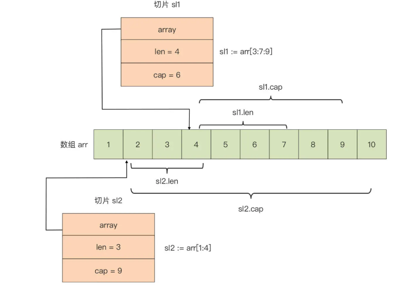


动态扩容

```go
var s []int
s = append(s, 11) 
fmt.Println(len(s), cap(s)) //1 1
s = append(s, 12) 
fmt.Println(len(s), cap(s)) //2 2
s = append(s, 13) 
fmt.Println(len(s), cap(s)) //3 4
s = append(s, 14) 
fmt.Println(len(s), cap(s)) //4 4
s = append(s, 15) 
fmt.Println(len(s), cap(s)) //5 8
```

tips：扩容时会分配新的数组，切片会与原数组解除“绑定”，注意别踩坑！


## 复合数据类型


### 原生 Map 类型

```go
// Go 语言中要求，key 的类型必须支持“==”和“!=”两种比较操作符
map[key_type]value_type

// 在 Go 语言中，函数类型、map 类型自身，以及切片
// 只支持与 nil 的比较，不支持同类型两个变量的比较
// 所以函数类型、map 类型自身，以及切片类型是不能作为 map 的 key 类型的
s := make([]int, 1)			// slice can only be compared to nil
f := func() {}				// func can only be compared to nil
m := make(map[int]string)	// map can only be compared to nil
```


初始化

```go
// 初始化
var m map[string]int // m = nil
// 无法“零值可用”
m["key"] = 1 // panic: assignment to entry in nil map


// “零值可用”（初值为零值 nil 的 map 类型变量）

// 方法1.复合字面值：
m := map[int]string{}

m1 := map[int][]string{
    1: []string{"val1_1", "val1_2"},
    7: []string{"val7_1"},
}

type Position struct { 
    x float64 
    y float64
}
m2 := map[Position]string{
    Position{29.935523, 52.568915}: "school",
    Position{73.224455, 111.804306}: "hospital",
}

// 语法糖：省略字面值中的元素类型
m2 := map[Position]string{
    {29.935523, 52.568915}: "school",
    {73.224455, 111.804306}: "hospital",
}

// 方法2.使用 make 初始化：
m1 := make(map[int]string) // 未指定初始容量
m2 := make(map[int]string, 8) // 指定初始容量为8
```


基本操作

```go
// 插入
m := make(map[int]string)
m[1] = "value1"

// 数量	（不能用 cap）
len(m)   

// 查找	（即使不存在，也会拿到零值）
v := m["key1"]

// 查找：comma ok 惯用法
v, ok := m["key1"]if !ok {}
// 直接判断是否存在
_, ok := m["key1"]

// 删除
delete(m, "key2")

// 遍历	（注意：map 是无序的）
for k, v := range m {}
for _, v := range m {}
for k:= range m {}
```


#### 实现（内存布局）

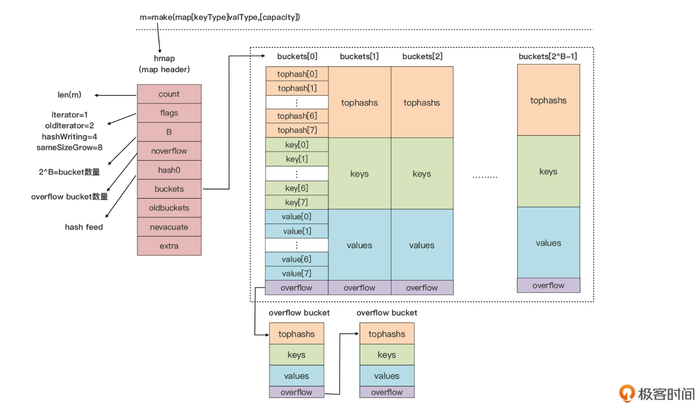

初始状态	（默认 bucket 为8，在 reflect.go 中定义）

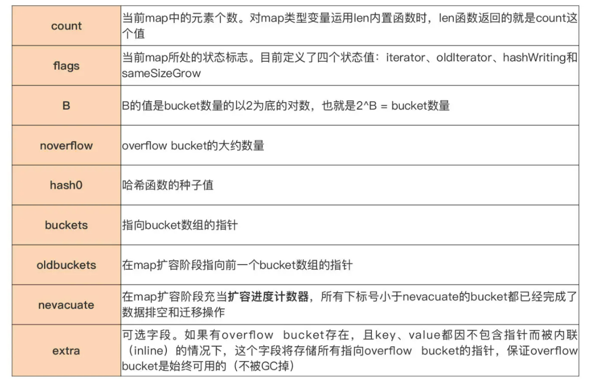

哈希处理（tophash 区域）

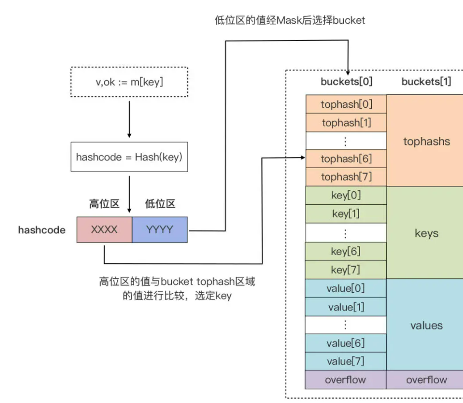

key 存储区域

```go
// 声明时生成 runtime.maptype 实例，包含所有元信息
// hash 函数在 maptype.key.alg.hash(key, hmap.hash0)
type maptype struct {
    typ        _type
    key        *_type
    elem       *_type
    bucket     *_type // internal type representing a hash bucket
    keysize    uint8  // size of key slot
    elemsize   uint8  // size of elem slot
    bucketsize uint16 // size of bucket
    flags      uint32
} 
```

value 存储区域

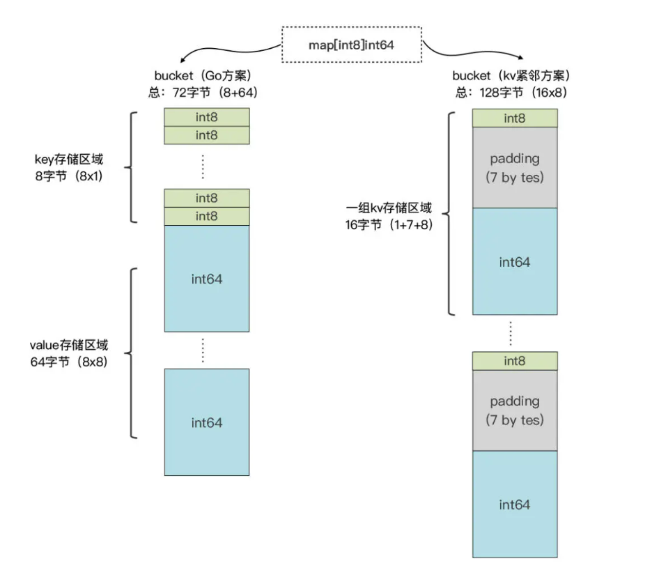

如果 key 或 value 的数据长度过大，那么运行时不会在 bucket 中直接存储数据，会存储 key 或 value 数据的指针，目前 Go 运行时定义的最大 key 和 value 长度：

```go
// $GOROOT/src/runtime/map.go
const (
    maxKeySize  = 128
    maxElemSize = 128
)
```

map 扩容

```go
// 扩容判定：count > LoadFactor * 2^B 或 overflow bucket 过多时
// 1.17 版本 LoadFactor 设置为 6.5（loadFactorNum/loadFactorDen）

// $GOROOT/src/runtime/map.go
const (
  ... ...

  loadFactorNum = 13
  loadFactorDen = 2
  ... ...
)

func mapassign(t *maptype, h *hmap, key unsafe.Pointer) unsafe.Pointer {
  ... ...
  if !h.growing() && (overLoadFactor(h.count+1, h.B) || tooManyOverflowBuckets(h.noverflow, h.B)) {
    hashGrow(t, h)
    goto again // Growing the table invalidates everything, so try again
  }
  ... ...
}
```

overflow bucket 过多时会在 assign 和 delete 时做排空和迁移（2倍扩容）

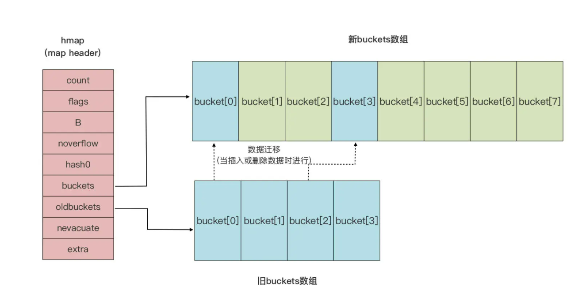


并发：无并发写保护，1.9引入并发写安全的 [sync.Map](https://pkg.go.dev/sync#Map)

```go
// 例子
package main
import (
    "fmt"
    "time"
)

func doIteration(m map[int]int) {
    for k, v := range m {
        _ = fmt.Sprintf("[%d, %d] ", k, v)
    }
}

func doWrite(m map[int]int) {
    for k, v := range m {
        m[k] = v + 1
    }
}

func main() {
    m := map[int]int{
        1: 11,
        2: 12,
        3: 13,
    }
    go func() {
        for i := 0; i < 1000; i++ {
            doIteration(m)
        }
    }()
    go func() {
        for i := 0; i < 1000; i++ {
            doWrite(m)
        }
    }()
    time.Sleep(5 * time.Second)
}

// 结果：
fatal error: concurrent map iteration and map write
```

其他

```go
// map 的自动扩容会导致 value 地址变化，
// 所以 Go 不允许获取 map 中 value 的地址

p := &m[key]  // cannot take the address of m[key]
fmt.Println(p)
```

```go
// map 是由 Go 编译器与运行时联合实现的。
// Go 编译器在编译阶段会将语法层面的 map 操作，重写为运行时对应的函数调用。
// Go 运行时则采用了高效的算法实现了 map 类型的各类操作

// 如何实现有序的功能：
// 把key存到有序切片中，用切片遍历
```

学习链接：[理解 Go Map 的原理](https://draveness.me/golang/docs/part2-foundation/ch03-datastructure/golang-hashmap/)


### 结构体 struct


定义新类型

```go
// 定义一个新类型 T，S 可以为原生类型或已有自定义类型
type T S 

// 底层类型（Underlying Type）用来判断两个类型本质上是否相同（Identical）
// 本质上相同的两个类型，它们的变量可以通过显式转型进行相互赋值
type T1 int
type T2 T1
type T3 string

func main() {
    var n1 T1
    var n2 T2 = 5
    n1 = T1(n2)  // ok
    
    var s T3 = "hello"
    n1 = T1(s) // 错误：cannot convert s (type T3) to type T1
}

// 基于字面值定义新类型 + type块定义
type (
   M map[int]string
   S []string
)

// 使用类型别名（Type Alias）定义新类型，通常用在项目的渐进式重构
type T = S  // 完全等价
```

定义结构体类型

```go
// 定义结构体类型
type T struct {
    Field1 T1
    Field2 T2
    ... ...
    FieldN Tn
}

// 空结构体类型
type Empty struct{} 
var s Empty
println(unsafe.Sizeof(s)) // 内存占用为0

// 空结构体元素作为一种“事件”信息进行 Goroutine 之间的通信
// 是内存占用最小的 Goroutine 间通信方式
var c = make(chan Empty) // 声明一个元素类型为Empty的channel
c<-Empty{}               // 向channel写入一个“事件”

// 嵌套结构体
type Person struct {
    Name string
}
type Book struct {
    Title string
    // Author Person
    Person  // 嵌入字段（Embedded Field）（匿名字段）
}

var book Book 
println(book.Person.Phone) // 将类型名当作嵌入字段的名字
println(book.Phone)        // 支持直接访问嵌入字段所属类型中字段

// 不可以递归嵌入（invalid recursive type T）
// 但可以拥有：
type T struct {
    t  *T           // 以自身类型的指针类型 ok 
    st []T          // 以自身类型为元素类型的切片类型 ok
    m  map[string]T // 以自身类型作为 value 类型的 map 类型的字段 ok
}     
```


零值不可用与零值可用

```go
// 零值无需初始化即可使用的例子：

var mu sync.Mutex
mu.Lock()
mu.Unlock()

var b bytes.Buffer
b.Write([]byte("Hello, Go"))
fmt.Println(b.String()) // 输出：Hello, Go
```


声明与初始化

```go
// 声明
var book Book
var book = Book{}
book := Book{}

// 显式初始化 （不推荐，go vet 工具还提供了检测规则 “composites”） 
var book = Book{"The Go Programming Language", 700, make(map[string]int)}

// 复合字面值初始化（“field:value”形式）未设置的默认零值
var t = T{
    F2: "hello",
    F1: 11,
}

// 结构体零值
t := T{}
// 少用的 new
tp := new(T)

// 特定的构造函数初始化 （例如在结构体包含未导出字段，并且为零值不可用的时候）
// 专用构造函数，例如： $GOROOT/src/time/sleep.go
func NewTimer(d Duration) *Timer {
    c := make(chan Time, 1)
    t := &Timer{
        C: c,
        r: runtimeTimer{
            when: when(d),
            f:    sendTime,
            arg:  c,
        },
    }
    startTimer(&t.r)
    return t
}

```

#### 实现（内存布局）

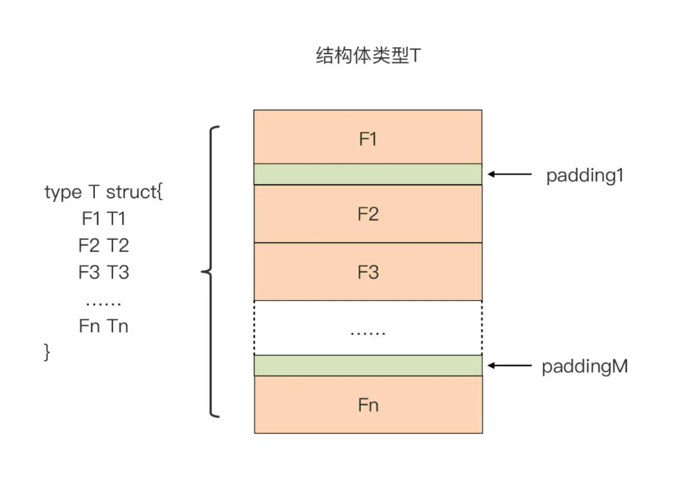

```go
var t T
unsafe.Sizeof(t)      // 结构体类型变量占用的内存大小
unsafe.Offsetof(t.Fn) // 字段Fn在内存中相对于变量t起始地址的偏移量
```


填充物（Padding），内存对齐例子：

```go
type T struct {
    b byte

    i int64
    u uint16
}
```

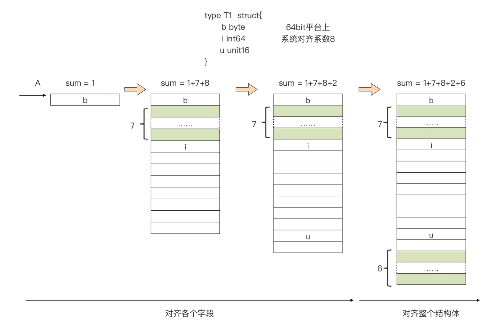

```go
// 平铺形式存放在连续内存块中(数组也是)

// 第一阶段：对齐结构体的各个字段
// 第二阶段：对齐整个结构体
// 个别处理器无法处理未对齐的数据，x86存取性能会受影响

// 不同顺序也会影响大小
type T struct {
    b byte
    i int64
    u uint16
}

type S struct {
    b byte
    u uint16
    i int64
}

func main() {
    var t T
    println(unsafe.Sizeof(t)) // 24
    var s S
    println(unsafe.Sizeof(s)) // 16
}
```

主动填充，例如 runtime 包中的 mstats

```go
// $GOROOT/src/runtime/mstats.go
type mstats struct {
    ... ...
    // Add an uint32 for even number of size classes to align below fields
    // to 64 bits for atomic operations on 32 bit platforms.
    _ [1 - _NumSizeClasses%2]uint32 // 这里做了主动填充

    last_gc_nanotime uint64 // last gc (monotonic time)
    last_heap_inuse  uint64 // heap_inuse at mark termination of the previous GC
    ... ...
}
```

学习链接：[struct 内存对齐](https://geektutu.com/post/hpg-struct-alignment.html)


## 控制结构：if


### if 语句

```go
if boolean_expression1 { 
    // 分支1
} if else boolean_expression2 { 
    // 分支2
} else { 
    // 分支3
}

// 等价于

if boolean_expression1 {
    // 分支1
} else {
    if boolean_expression2 {
       // 分支2
    } else { 
       // 分支3
    }
}
```


if 语句支持声明自用变量（惯用法）

```go
if a, c := f(), h(); a > 0 {
    println(a)
} else if b := f(); b > 0 {
    println(a, b)
} else {
    println(a, b, c)
}
```


### 逻辑操作符（最高优先级）

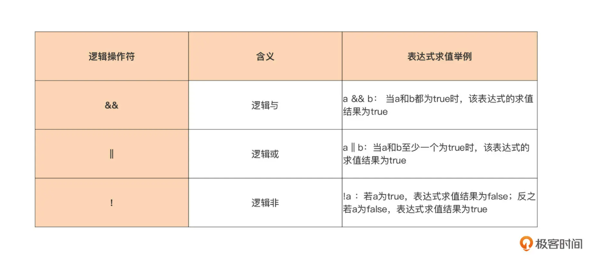

### 其他操作符


可以使用带有小括号的子布尔表达式来清晰表达判断条件


### “快乐路径（Happy Path）”原则

- 单分支结构
- 失败立即返回 
- 成功的逻辑始终“居左”并延续到函数结尾
- 代码扁平，无深度缩进


Tips：if命中排列（流水线技术和分支预测）


##  控制结构：for


### for 循环

```go
for preStmt; condition; postStmt { … }
```

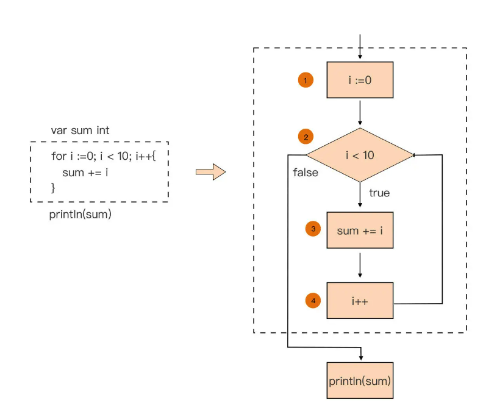

① 循环前置语句，仅执行一次
② 条件判断表达式
③ 循环体
④ 循环后置语句


for 支持声明多循环变量

```go
for i, j, k := 0, 1, 2; (i < 20) && (j < 10) && (k < 30); i, j, k = i+1, j+1, k+5 { 
    sum += (i + j + k) 
    println(sum)
}
```


循环体必须，其他可省略

```go
i := 0
for ; i < 10; {   // 省略前置+后置语句， 或写作 for i < 10 {}
    println(i) i++
}

for {    // 等同于 for true {} ，或写作 for ; ; {} 
    // 全省略，只剩下循环体
}
```


### for range 循环


go 自带针对切片与 string 等类型的 for 语法糖 for range ：


#### 切片类型

```go
var sl = []int{1, 2, 3, 4, 5}
for i := 0; i < len(sl); i++ {    
    fmt.Printf("sl[%d] = %d\n", i, sl[i])
}

for i, v := range sl {
    fmt.Printf("sl[%d] = %d\n", i, v)
}

// 变种1：只拿下标
for i := range sl {
}
// 变种2：只拿值
for _, v := range sl {
}
// 变种3：纯循环
for range sl {  // 等同于 for _, _ = range sl {}
}
```


#### string 类型

每次返回 rune 类型值

```go
var s = "中国人"
for i, v := range s {
    fmt.Printf("%d %s 0x%x\n", i, string(v), v)
}

// 输出：
0 中 0x4e2d
3 国 0x56fd
6 人 0x4eba

// i 为该 Unicode 字符码点的内存编码（UTF-8）的第一个字节在字符串内存序列中的位置

```


#### map 类型

```go
var m = map[string]int {
    "Rob" : 67,
    "Russ" : 39,
}

for k, v := range m {
    println(k, v)
}
```


#### channel 类型

channel 是 Go 语言提供的并发设计的原语，它用于多个 Goroutine 之间的通信

```go
var c = make(chan int)
for v := range c {
   // channel 关闭时循环才会结束，不然会阻塞在对 channel 的读操作上
}
```


#### continue 语句（支持 label）

continue：中断当前循环体，并继续下一次迭代

continue+label：一般用于跳转到外层循环并继续执行外层循环语句的下一个迭代

```go
	var sum int
	var sl = []int{1, 2, 3, 4, 5, 6}
	for i := 0; i < len(sl); i++ {
		if sl[i]%2 == 0 {
			continue // 忽略切片中值为偶数的元素
		}
		sum += sl[i]
	}
	println(sum) // 9

	// 等价于
	sum = 0
	sl = []int{1, 2, 3, 4, 5, 6}
loop:
	for i := 0; i < len(sl); i++ {
		if sl[i]%2 == 0 {
			continue loop // 忽略切片中值为偶数的元素
		}
		sum += sl[i]
	}
	println(sum) // 9
```


#### break 语句（支持 label）

break：跳出循环

break+label：同上，可以直接终结外层循环


#### 常见问题


##### 循环变量的重用

```go
func main() {
    var m = []int{1, 2, 3, 4, 5}  
             
    for i, v := range m {
        go func() {
            time.Sleep(time.Second * 3)
            fmt.Println(i, v)
        }()
    }
    time.Sleep(time.Second * 10)
}
// 隐式代码块转换后：
func main() {
    var m = []int{1, 2, 3, 4, 5}  
    {
      	i, v := 0, 0  // 循环变量在 for range 语句中仅会被声明一次
        for i, v = range m {
            go func() {
                time.Sleep(time.Second * 3)
                fmt.Println(i, v)
            }()
        }
    }
    time.Sleep(time.Second * 10)
}
// 运行结果：
4 5
4 5
...

// 修改成正确预期：
func main() {
    var m = []int{1, 2, 3, 4, 5}
    for i, v := range m {
        go func(i, v int) { // 创建时将参数与 i、v 的当时值进行绑定
            time.Sleep(time.Second * 3)
            fmt.Println(i, v)
        }(i, v)
    }
    time.Sleep(time.Second * 10)
}

```


##### 参与循环的是 range 表达式的副本

go 是值拷贝，range中也一样

```go
func main() {
    var a = [5]int{1, 2, 3, 4, 5}
    var r [5]int
    fmt.Println("original a =", a)
    for i, v := range a {
        if i == 0 {
            a[1] = 12
            a[2] = 13
        }
        r[i] = v
    }
    fmt.Println("after for range loop, r =", r)
    fmt.Println("after for range loop, a =", a)
}

// 使用切片优化：
func main() {
    var a = [5]int{1, 2, 3, 4, 5}
    var r [5]int
    fmt.Println("original a =", a)
    for i, v := range a[:] {
        if i == 0 {
            a[1] = 12
            a[2] = 13
        }
        r[i] = v
    }
    fmt.Println("after for range loop, r =", r)
    fmt.Println("after for range loop, a =", a)
}

// 或者用数组指针替换数组
```


##### 遍历 map 中元素的随机性

在循环过程中如果对map进行了修改，那么结果和遍历map一样具有随机性，可能成功也可能不成功

> map的遍历顺序有随机性。但这种随机仅仅是在创建初始iterator时随机选择一个bucket。
>
> 假设按bucket2->bucket3->...顺序迭代，假设已经遍历完bucket2，正在遍历bucket3，此时插入lucy这个key，恰插到bucket2中，由于之前已经遍历完bucket2，后续的遍历不会再重复遍历bucket2，于是lucy便无法出现在后续遍历路径上。如果lucy插入到bucket3后面的bucket中，则会出现在遍历路径上，我们就能看到这个key。
>
> key存储在哪里是根据hash值来定的


## 控制结构：switch


### 一般形式

```go
// initStmt 可选，可用来声明临时变量
// expr 用来匹配，很灵活，只要类型支持比较都可以使用，例如自定义结构体
// case expr 执行次序按照顺序执行
// break：支持表达式列表，分支代码运行结束后即退出switch语句
// fallthrough 关键字：不退出 switch 语句，直接执行下一个 case（不求值），并且不能放在最后面
//（“显式”哲学）
switch initStmt; expr {  
    case expr1:
        // 执行分支1
    case expr2:
        // 执行分支2
    case expr3_1, expr3_2, expr3_3:  // 支持表达式列表
        // 执行分支3
    case expr4:
        // 执行分支4
    	fallthrough // 继续执行下一个 case，不退出
    case exprN:
        // 执行分支N
    default: 
        // 执行默认分支
}

// 精简写法：

// 带有 initStmt 语句的 switch 语句
switch initStmt; {
    case bool_expr1:
    ...
}
// 没有 initStmt 语句的 switch 语句
switch {
    case bool_expr1:
    ...
}
```


### type switch

```go
// type switch 里是不能 fallthrough 的

func main() {
    var x interface{} = 13
    
    // 获取动态类型信息
    // x.(type) 是 switch 语句专有的表达式形式（type guard），而不是初始化语句，所以没有分号
    // x 必须为接口类型变量 （Go所有类型都实现了该接口）
    switch x.(type) { 
    case nil:
        println("x is nil")
    case int:
        println("the type of x is int")
    case string:
        println("the type of x is string")
    case bool:
        println("the type of x is string")
    default:
        println("don't support the type")
    }
}

func main() {
    var x interface{} = 13
    // 获取值信息
    switch v := x.(type) {
    case nil:
        println("v is nil")
    case int:
        println("the type of v is int, v =", v)
    case string:
        println("the type of v is string, v =", v)
    case bool:
        println("the type of v is bool, v =", v)
    default:
        println("don't support the type")
    }
}


// 特定的接口类型 I
type I interface {
	M()
}
type T struct {}

func (T) M() {}
 
func main() {
    var t T
    var i I = t
	switch i.(type) {
	case T:
		println("it is type T")
	case int: // 会报错：impossible type switch case
		println("it is type int")
	case string:// 会报错：impossible type switch case
		println("it is type string")
	}
}
```


Tips：switch 会阻拦 break 语句跳出 for 循环


### 额外笔记

与 java17 对比

Java17 switch

```java
String checkWorkday(int day) {
	return switch (day) {
		case 1, 2, 3, 4, 5 -> "it is a work day";
		case 6, 7 -> "it is a weekend day";
		default -> "are you live on earth";
	};
}
```

Go switch

```go
func checkWorkday(day int) string {
	switch day {
	case 1, 2, 3, 4, 5:
		return "it is a work day"
	case 6, 7:
		return "it is a weekend day"
	default:
		return "are you live on earth"
	}
}
```


## 函数


函数是唯一一种基于特定输入，实现特定任务并可返回任务执行结果的代码块

（Go 语言中的方法本质上也是函数，可以说 Go 程序就是一组函数的集合）


### 函数声明


普通 Go 函数的声明：

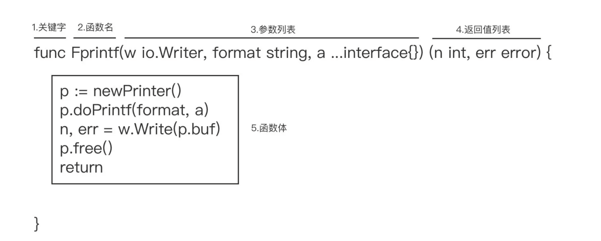

等价转换为变量声明：

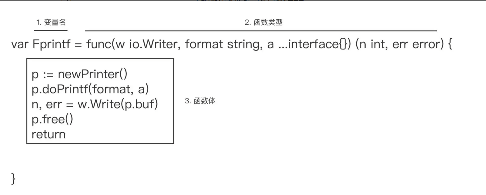


函数声明中的 **func 关键字**、**参数列表**和**返回值列表**共同构成了**函数类型**

参数列表与返回值列表的组合也被称为**函数签名**

例如上面的Fprintf的函数类型是：`func(io.Writer, string, ...interface{}) (int, error)`


结论：每个函数声明所定义的函数，仅仅是对应的函数类型的一个实例

（就像 `var a int = 13 `这个变量声明语句中 a 是 int 类型的一个实例一样）


```go
s := T{}      // 使用复合类型字面值对结构体类型T的变量进行显式初始化
f := func(){} // 使用函数字面值（Function Literal）声明形式的函数声明，也叫匿名函数
```


### 函数参数


**形参**（Parameter，形式参数）与 **实参**（Argument，实际参数）

传入的是实参，使用的是形参

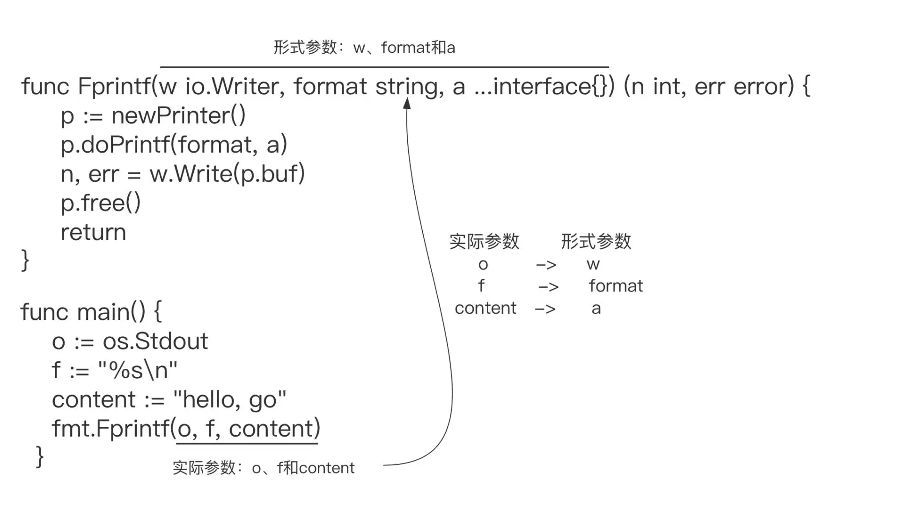


当我们实际调用函数的时候，实参会传递给函数，并和形式参数逐一绑定。

编译器会根据各个形参的类型与数量进行匹配校验，校验不通过则报错。


Go 语言中，函数参数传递采用是**值传递**的方式，

指将实际参数在内存中的表示逐位拷贝（Bitwise Copy）到形式参数中。

整型、数组、结构体内存表示就是它们自身数据，传递的开销成正比。

string、切片、map 内存表示是“描述符”，值传递的是“描述符”，也被称为“浅拷贝”。


例外：

对于类型为接口类型的形参，Go 编译器会把传递的实参赋值给对应的接口类型形参

对于为变长参数的形参，Go 编译器会将零个或多个实参按一定形式转换为对应的变长形参


**变长参数**实际上是通过切片来实现的：

```go
func myAppend(sl []int, elems ...int) []int {
    fmt.Printf("%T\n", elems) // []int
    if len(elems) == 0 {
        println("no elems to append")
        return sl
    }

    sl = append(sl, elems...)
    return sl
}

func main() {
    sl := []int{1, 2, 3}
    sl = myAppend(sl) // no elems to append
    fmt.Println(sl) // [1 2 3]
    sl = myAppend(sl, 4, 5, 6)
    fmt.Println(sl) // [1 2 3 4 5 6]
}
```


### 函数多返回值


```go
func foo()                       // 无返回值
func foo() error                 // 仅有一个返回值
func foo() (int, string, error)  // 有2或2个以上返回值

func foo() (i int, e error)  	// 具名返回值（Named Return Value）
```


Go 标准库以及大多数项目代码中的函数，都选择了使用普通的非具名返回值形式

当函数使用 defer，而且还在 defer 函数中修改外部函数返回值时、

或者当函数的返回值个数较多时，用具名返回值可以让函数实现的可读性更好一些

例如：

```go
// $GOROOT/src/time/format.go
func parseNanoseconds(value string, nbytes int) (ns int, rangeErrString string, err error) {
    if !commaOrPeriod(value[0]) {
        err = errBad
        return
    }
    if ns, err = atoi(value[1:nbytes]); err != nil {
        return
    }
    if ns < 0 || 1e9 <= ns {
        rangeErrString = "fractional second"
        return
    }

    scaleDigits := 10 - nbytes
    for i := 0; i < scaleDigits; i++ {
        ns *= 10
    }
    return
}
```


### 函数是“一等公民”


函数在 Go 语言中属于“一等公民（First-Class Citizen）”。


wiki 发明人、C2 站点作者沃德·坎宁安 (Ward Cunningham)对“一等公民”的解释：

>   如果一门编程语言对某种语言元素的创建和使用没有限制，我们可以像对待值（value）一样对待这种语法元素，那么我们就称这种语法元素是这门编程语言的“一等公民”。拥有“一等公民”待遇的语法元素可以存储在变量中，可以作为参数传递给函数，可以在函数内部创建并可以作为返回值从函数返回。


（头等函数是[函数式程序设计](https://zh.m.wikipedia.org/zh-hans/函数式程序设计)所必须的；JS、PHP等语言也支持）


**特征一：一等公民的语法元素是可以存储在变量中的**

```go
var (
    myFprintf = func(w io.Writer, format string, a ...interface{}) (int, error) {
        return fmt.Fprintf(w, format, a...)
    }
)
func main() {
    fmt.Printf("%T\n", myFprintf) // func(io.Writer, string, ...interface {}) (int, error)
    myFprintf(os.Stdout, "%s\n", "Hello, Go") // 输出Hello，Go
}
```


**特征一：支持在函数内创建并通过返回值返回**

```go
func setup(task string) func() {
    println("do some setup stuff for", task) 
    return func() {
        // 在匿名函数里面用到局部变量 task // 闭包（Closure）
        // 只要闭包可以被访问，这些共享的变量就会继续存在
        println("do some teardown stuff for", task) 
    }
}
func main() {
    teardown := setup("demo")	// 上下文建立（setup）
    defer teardown()			// 上下文拆除（teardown）
    println("do some bussiness stuff")
}
```


**特征一：作为参数传入函数**

```go
time.AfterFunc(time.Second*2, func() { println("timer fired") })
```


**特征一：拥有自己的函数类型**

```go
// $GOROOT/src/net/http/server.go
type HandlerFunc func(ResponseWriter, *Request)

// $GOROOT/src/sort/genzfunc.go
type visitFunc func(ast.Node) ast.Visitor
```


### 函数“一等公民”特性的高效运用


**应用一：函数可以被显式转型**


Web Server 的例子

```go
// 1b. greeting 的函数类型：func(http.ResponseWriter, *http.Request) ，一样
func greeting(w http.ResponseWriter, r *http.Request) {
    fmt.Fprintf(w, "Welcome, Gopher!\n")
} 

func main() {
    // 1c. 直接传入 greeting 会报错：http.ListenAndServe(":8080", greeting)
    // 报：func(http.ResponseWriter, *http.Request) does not implement http.Handler (missing ServeHTTP method)  函数还没有实现接口 Handler 的方法，无法将它赋值给 Handler 类型的参数
    http.ListenAndServe(":8080", http.HandlerFunc(greeting))
}
```

ListenAndServe 的源码

```go
// $GOROOT/src/net/http/server.go
// ListenAndServe 会把来自客户端的 http 请求，交给它的第二个参数 handler 处理
func ListenAndServe(addr string, handler Handler) error {
    server := &Server{Addr: addr, Handler: handler}
    return server.ListenAndServe()
}
```

自定义的接口类型 Handler

```go
// $GOROOT/src/net/http/server.go
type Handler interface {
    // 1a. ServeHTTP 的函数类型：func(http.ResponseWriter, *http.Request)，一样
    ServeHTTP(ResponseWriter, *Request)  
}
```

将函数 greeting 显式转换为 HandlerFunc 类型：http.HandlerFunc

```go
// $GOROOT/src/net/http/server.go

// 函数类型 func(ResponseWriter, *Request)，并且也有 Handler 接口的 ServeHTTP 方法
type HandlerFunc func(ResponseWriter, *Request)

// ServeHTTP calls f(w, r).
func (f HandlerFunc) ServeHTTP(w ResponseWriter, r *Request) {
        f(w, r)
}
```


与下面整型变量的显式转型原理一样的

```go
// MyInt的底层类型为int，类比HandlerFunc的底层类型为func(ResponseWriter, *Request)
type MyInt int
var x int = 5
y := MyInt(x) 
```


**应用二：利用闭包简化函数调用**


```go
func times(x, y int) int {
  return x * y
}

// 一堆高频固定参数的调用
times(2, 5) // 计算2 x 5
times(3, 5) // 计算3 x 5
times(4, 5) // 计算4 x 5

// 简化：
func partialTimes(x int) func(int) int {
  return func(y int) int {
    return times(x, y)
  }
}

func main() {
  timesTwo := partialTimes(2)   // 以高频乘数2为固定乘数的乘法函数
  timesThree := partialTimes(3) // 以高频乘数3为固定乘数的乘法函数
  timesFour := partialTimes(4)  // 以高频乘数4为固定乘数的乘法函数
  fmt.Println(timesTwo(5))   // 10，等价于times(2, 5)
  fmt.Println(timesTwo(6))   // 12，等价于times(2, 6)
  fmt.Println(timesThree(5)) // 15，等价于times(3, 5)
  fmt.Println(timesThree(6)) // 18，等价于times(3, 6)
  fmt.Println(timesFour(5))  // 20，等价于times(4, 5)
  fmt.Println(timesFour(6))  // 24，等价于times(4, 6)
}

// 在那些动辄就有 5 个以上参数的复杂函数中，减少参数的重复输入给开发人员带去的收益，可要比这个简单的例子大得多
```


## 函数：**错误处理**设计


### 错误处理的方式


C：基于**错误值比较**，一值多用，耦合高

```c
// stdio.h 
int fprintf(FILE * restrict stream, const char * restrict format, ...);
```

Go：**多返回值**机制，解耦

```go
// fmt包
// 惯用法：使用 error 这个接口类型表示错误，并且一般放在返回值末尾
func Fprintf(w io.Writer, format string, a ...interface{}) (n int, err error)
```


### error 类型与错误值构造


**error 接口**

```go
// $GOROOT/src/builtin/builtin.go
type error interface {
    Error() string
}
```


**提供构造错误值的方法**

```go
err := errors.New("your first demo error")
errWithCtx = fmt.Errorf("index %d is out of bounds", i)
```

返回值 errorString：

```go
// $GOROOT/src/errors/errors.go
type errorString struct {
    s string // 错误上下文（Error Context），仅限于字符串形式
}

func (e *errorString) Error() string {
    return e.s
}
```


**自定义错误类型**

```go
// $GOROOT/src/net/net.go
type OpError struct {
    Op string
    Net string
    Source Addr
    Addr Addr
    Err error
}


// $GOROOT/src/net/http/server.go
func isCommonNetReadError(err error) bool {
    if err == io.EOF {
        return true
    }
    if neterr, ok := err.(net.Error); ok && neterr.Timeout() {
        return true
    }
    if oe, ok := err.(*net.OpError); ok && oe.Op == "read" {
        return true
    }
    return false
}
```


### 好处

1.   统一错误类型
2.   错误是值
3.   易扩展，支持自定义错误上下文


### 惯用策略


#### 策略一：透明错误处理策略


最常见的错误处理策略，根据错误值进行决策，并选择后续执行路径

```go
err := doSomething()
if err != nil {
    // 不关心err变量底层错误值所携带的具体上下文信息
    // 执行简单错误处理逻辑并返回
    ... ...
    return err
}

func doSomething(...) error {
    ... ...
    return errors.New("some error occurred")
}
```


#### 策略二：“哨兵”错误处理策略


反模式的错误检视（严重的隐式耦合）：

```go
data, err := b.Peek(1)
if err != nil {
    switch err.Error() {
    case "bufio: negative count": // 提供字符串比较，严重隐式耦合，并且检视（inspect）性能也差
        // ... ...
        return
    case "bufio: buffer full":
        // ... ...
        return
    case "bufio: invalid use of UnreadByte":
        // ... ...
        return
    default:
        // ... ...
        return
    }
}
```


定义导出（Exported）的 "哨兵" 错误值进行检视（会成为API的一部分，会有依赖，开发者需要维护）：

```go
// $GOROOT/src/bufio/bufio.go
var (
    ErrInvalidUnreadByte = errors.New("bufio: invalid use of UnreadByte")
    ErrInvalidUnreadRune = errors.New("bufio: invalid use of UnreadRune")
    ErrBufferFull        = errors.New("bufio: buffer full")
    ErrNegativeCount     = errors.New("bufio: negative count")
)

data, err := b.Peek(1)
if err != nil {
    switch err {
    case bufio.ErrNegativeCount:
        // ... ...
        return
    case bufio.ErrBufferFull:
        // ... ...
        return
    case bufio.ErrInvalidUnreadByte:
        // ... ...
        return
    default:
        // ... ...
        return
    }
}
```


从 Go 1.13 版本开始，标准库 errors 包提供了 Is 函数：

```go
// 类似 if err == ErrOutOfBounds
// 把一个 error 类型变量与“哨兵”错误值进行比较
if errors.Is(err, ErrOutOfBounds) {
    // 越界的错误处理
}

// 不同的是，如果 error 类型变量的底层错误值是一个包装错误（Wrapped Error），
// errors.Is 方法会沿着该包装错误所在错误链（Error Chain)，
// 与链上所有被包装的错误（Wrapped Error）进行比较，直至找到一个匹配的错误为止：
var ErrSentinel = errors.New("the underlying sentinel error")
func main() {
    err1 := fmt.Errorf("wrap sentinel: %w", ErrSentinel)
    err2 := fmt.Errorf("wrap err1: %w", err1)
    println(err2 == ErrSentinel) // false
    if errors.Is(err2, ErrSentinel) {
        println("err2 is ErrSentinel")
        return
    }
    println("err2 is not ErrSentinel")
}
// false
// err2 is ErrSentinel
```


>建议尽量使用 errors.Is 方法去检视某个错误值是否就是某个预期错误值，或者包装了某个特定的“哨兵”错误值。


#### 策略三：错误值类型检视策略


需要更多的错误上下文，可以通过自定义错误类型来提供；

错误处理方需要使用 Go 提供的类型断言机制（Type Assertion）或类型选择机制（Type Switch）进行处理：

```go
// $GOROOT/src/encoding/json/decode.go
type UnmarshalTypeError struct {
    Value  string       
    Type   reflect.Type 
    Offset int64        
    Struct string       
    Field  string      
}

// $GOROOT/src/encoding/json/decode.go
func (d *decodeState) addErrorContext(err error) error {
    if d.errorContext.Struct != nil || len(d.errorContext.FieldStack) > 0 {
        switch err := err.(type) { // 获取到动态类型和值
        case *UnmarshalTypeError:
            err.Struct = d.errorContext.Struct.Name()
            err.Field = strings.Join(d.errorContext.FieldStack, ".")
            return err
        }
    }
    return err
}
```


从 Go 1.13 版本开始，标准库 errors 包提供了 As 函数：

```go
// 类似 if e, ok := err.(*MyError); ok { … }
var e *MyError
if errors.As(err, &e) {
    // 如果err类型为*MyError，变量e将被设置为对应的错误值
}

// 不同的是，如果 error 类型变量的动态错误值是一个包装错误，
// errors.As 函数会沿着该包装错误所在错误链，
// 与链上所有被包装的错误的类型进行比较，直至找到一个匹配的错误类型（就像 errors.Is 函数那样）：
type MyError struct {
    e string
}
func (e *MyError) Error() string {
    return e.e
}
func main() {
    var err = &MyError{"MyError error demo"}
    err1 := fmt.Errorf("wrap err: %w", err)
    err2 := fmt.Errorf("wrap err1: %w", err1)
    var e *MyError
    if errors.As(err2, &e) {
        println("MyError is on the chain of err2")
        println(e == err) // true           
        return                             
    }                                      
    println("MyError is not on the chain of err2")
} 

// MyError is on the chain of err2
// true
```


>   建议尽量使用 errors.As 方法去检视某个错误值是否是某自定义错误类型的实例。


#### 策略四：错误行为特征检视策略


但是策略二、策略三 在错误构建方与处理方还是建立了耦合，

可以将某个包中的错误类型归类，统一提取出一些公共的错误行为特征，

并将这些错误行为特征放入一个公开的接口类型中（错误行为特征检视策略）：

（相当于把判断逻辑提取，变成一个充血模型，把判断逻辑交还给本体）

```go
// $GOROOT/src/net/net.go
type Error interface {
    error
    Timeout() bool  
    Temporary() bool
}

// $GOROOT/src/net/http/server.go
func (srv *Server) Serve(l net.Listener) error {
    ... ...
    for {
        rw, e := l.Accept()
        if e != nil {
            select {
            case <-srv.getDoneChan():
                return ErrServerClosed
            default:
            }
            if ne, ok := e.(net.Error); ok && ne.Temporary() {
                // 注：这里对临时性(temporary)错误进行处理
                ... ...
                time.Sleep(tempDelay)
                continue
            }
            return e
        }
        ...
    }
    ... ...
}

// 在上面代码中，Accept 方法实际上返回的错误类型为*OpError，它是 net 包中的一个自定义错误类型，它实现了错误公共特征接口net.Error，如下代码所示：

// $GOROOT/src/net/net.go
type OpError struct {
    ... ...
    // Err is the error that occurred during the operation.
    Err error
}

type temporary interface {
    Temporary() bool
}

func (e *OpError) Temporary() bool {
  if ne, ok := e.Err.(*os.SyscallError); ok {
      t, ok := ne.Err.(temporary)
      return ok && t.Temporary()
  }
  t, ok := e.Err.(temporary)
  return ok && t.Temporary()
}
```


>   这些策略都有适用的场合，没有某种单一的错误处理策略可以适合所有项目或所有场合
>
>   -   请尽量使用“透明错误”处理策略，降低错误处理方与错误值构造方之间的耦合；
>   -   如果可以从众多错误类型中提取公共的错误行为特征，那么请尽量使用“错误行为特征检视策略”;
>   -   在上述两种策略无法实施的情况下，再使用“哨兵”策略和“错误值类型检视”策略；
>   -   Go 1.13 及后续版本中，尽量用 errors.Is 和 errors.As 函数替换原先的错误检视比较语句。


## 函数：让函数更简洁健壮（**panic 与 defer**）


### 健壮性的“三不要”原则


原则一：不要相信任何外部输入的参数。（合法性检查）

原则二：不要忽略任何一个错误。（显式检查错误并处理）

原则三：不要假定异常不会发生。（考虑异常捕捉与恢复）


### Go 语言中的异常：panic


作用类似于C语言中的断言 assert ，一旦 assert 失败，便会 dump core 文件，程序终止。

无论在哪个 Goroutine 中发生未被恢复的 panic，整个程序都将崩溃退出


panic 来自于 Go 运行时 或使用 panic 函数主动触发（panicking）


当函数 F 调用 panic 函数时，函数 F 的执行将停止。不过，函数 F 中已进行求值的 deferred 函数都会得到正常执行，执行完这些 deferred 函数后，函数 F 才会把控制权返还给其调用者


```go
func foo() {
    println("call foo")
    bar()
    println("exit foo")
}

func bar() {
    println("call bar")
    panic("panic occurs in bar")
    zoo()
    println("exit bar")
}

func zoo() {
    println("call zoo")
    println("exit zoo")
}

func main() {
    println("call main")
    foo()
    println("exit main")
}

call main
call foo
call bar
panic: panic occurs in bar
```


### 恢复 panic：recover 函数


```go
func bar() {
    defer func() {
        if e := recover(); e != nil {
            // 如果 recover 捕捉到 panic，它就会返回以 panic 的具体内容为错误上下文信息的错误值
            // 如果 panic 被 recover 捕捉到，panic 引发的 panicking 过程就会停止
            // 如果没有 panic 发生，那么 recover 将返回 nil
            fmt.Println("recover the panic:", e)
        }
    }()
    println("call bar")
    panic("panic occurs in bar")
    zoo()
    println("exit bar")
}

call main
call foo
call bar
recover the panic: panic occurs in bar
exit foo
exit main
```


### 如何应对 panic


**第一点：评估程序对 panic 的忍受度**


不同应用对异常引起的程序崩溃退出的忍受度是不一样的

针对各种应用对 panic 忍受度的差异，我们采取的应对 panic 的策略也应该有不同


http server 采取局部不影响整体的异常处理策略：

```go
// $GOROOT/src/net/http/server.go
// Serve a new connection.
func (c *conn) serve(ctx context.Context) {
    c.remoteAddr = c.rwc.RemoteAddr().String()
    ctx = context.WithValue(ctx, LocalAddrContextKey, c.rwc.LocalAddr())
    defer func() {
        if err := recover(); err != nil && err != ErrAbortHandler { // 局部不影响整个服务
            const size = 64 << 10
            buf := make([]byte, size)
            buf = buf[:runtime.Stack(buf, false)]
            c.server.logf("http: panic serving %v: %v\n%s", c.remoteAddr, err, buf)
        }
        if !c.hijacked() {
            c.close()
            c.setState(c.rwc, StateClosed, runHooks)
        }
    }()
    ... ...
}
```


**第二点：提示潜在 bug**


在 Go 标准库中，大多数 panic 的使用都是充当类似断言的作用的


encoding/json 包模拟断言对潜在 bug 的提示：

```go
// $GOROOT/src/encoding/json/decode.go
... ...
//当一些本不该发生的事情导致我们结束处理时，phasePanicMsg将被用作panic消息
//它可以指示JSON解码器中的bug，或者
//在解码器执行时还有其他代码正在修改数据切片。

const phasePanicMsg = "JSON decoder out of sync - data changing underfoot?"

func (d *decodeState) init(data []byte) *decodeState {
    d.data = data
    d.off = 0
    d.savedError = nil
    if d.errorContext != nil {
        d.errorContext.Struct = nil
        // Reuse the allocated space for the FieldStack slice.
        d.errorContext.FieldStack = d.errorContext.FieldStack[:0]
    }
    return d
}

func (d *decodeState) valueQuoted() interface{} {
    switch d.opcode {
    default:
        panic(phasePanicMsg) // 走进这个分支的话，则可能是一个 bug
    case scanBeginArray, scanBeginObject:
        d.skip()
        d.scanNext()
    case scanBeginLiteral:
        v := d.literalInterface()
        switch v.(type) {
        case nil, string:
            return v
        }
    }
    return unquotedValue{}
}
```


```go
// $GOROOT/src/encoding/json/encode.go
func (w *reflectWithString) resolve() error {
    ... ...
    switch w.k.Kind() {
    case reflect.Int, reflect.Int8, reflect.Int16, reflect.Int32, reflect.Int64:
        w.ks = strconv.FormatInt(w.k.Int(), 10)
        return nil
    case reflect.Uint, reflect.Uint8, reflect.Uint16, reflect.Uint32, reflect.Uint64, reflect.Uintptr:
        w.ks = strconv.FormatUint(w.k.Uint(), 10)
        return nil
    }
    panic("unexpected map key type") // 走出分支的话，则可能是一个 bug
}

```


**第三点：不要混淆异常与错误**


Java 的checked exception -> 相当于 Go 中的 **error**  （本质是错误处理）

Java 的 RuntimeException + Error  -> 相当于 Go 中的 **panic** （本质是异常，出乎意料的）


>   一定不要将 panic 当作错误返回给 API 调用者


评论中的 tips：

>   Q：panic 无法跨 goroutine 捕获？
>
>   A：panic是一个 stack unwinding 的过程，而每个 goroutine 都有自己的执行栈。一个 goroutine 执行栈上发生的 panic，另外一个 goroutine 肯定是不知晓的


### 使用 defer 简化函数实现


defer 是 Go 语言提供的一种**延迟调用机制**（收尾工作），例子：

```go
func doSomething() error {
    var mu sync.Mutex
    mu.Lock()
    defer mu.Unlock() // 退出时释放锁

    r, err := OpenResource()
    if err != nil {
        return err
    }
    defer r.Close() // 退出时关闭资源
   
    // 使用r...
    
    return doWithResources() 
}
```


-   在 Go 中，只有在函数（和方法）内部才能使用 defer；

-   defer 关键字后面只能接函数（或方法），这些函数被称为 deferred 函数。defer 将它们注册到其所在 Goroutine 中，用于存放 deferred 函数的栈数据结构中，这些 deferred 函数将在执行 defer 的函数退出前，按**后进先出（LIFO）**的顺序被程序调度执行（如下图所示）
-   tips：可以跟踪函数的执行过程


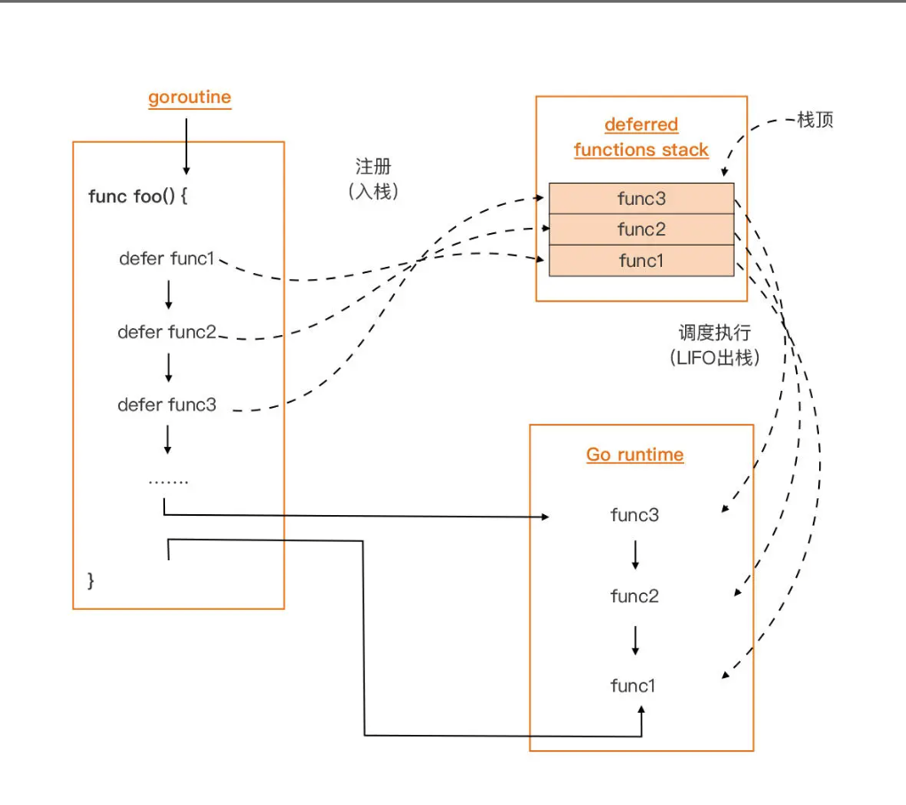


### defer 使用的注意事项


**第一点：明确哪些函数可以作为 deferred 函数**

-   有返回值的自定义函数或方法，返回值会被丢弃

-   除了自定义函数或方法，还有内置的或预定义的函数，如：

    ```go
    Functions:
      append cap close complex copy delete imag len
      make new panic print println real recover
    
    // defer1.go
     func main() {
         var c chan int
         var sl []int
         var m = make(map[string]int, 10)
         m["item1"] = 1
         m["item2"] = 2
         var a = complex(1.0, -1.4)
     
         var sl1 []int
         defer append(sl, 11) 	// defer discards result of append(sl, 11)
         defer cap(sl)  		// defer discards result of cap(sl)
         defer close(c)
         defer complex(2, -2) 	// defer discards result of complex(2, -2)
         defer copy(sl1, sl)
         defer delete(m, "item2")
         defer imag(a) 			// defer discards result of imag(a)
         defer len(sl) 			// defer discards result of len(sl)
         defer make([]int, 10) 	// defer discards result of make([]int, 10)
         defer new(*int) 		// defer discards result of new(*int)
         defer panic(1)
         defer print("hello, defer\n")
         defer println("hello, defer")
         defer real(a) 			// defer discards result of real(a)
         defer recover()
         
         defer func() {
          _ = append(sl, 11) 	// 可以使用一个包裹它的匿名函数来间接满足要求
        }()
     }
    
    // append、cap、len、make、new、imag 等内置函数都是不能直接作为 deferred 函数的
    // close、copy、delete、print、recover 等内置函数则可以直接被 defer 设置为 deferred 函数
    ```


**第二点：注意 defer 关键字后面表达式的求值时机**

defer 关键字后面的表达式，是在将 deferred 函数注册到 deferred 函数栈的时候进行求值的。

```go
func foo1() {
    for i := 0; i <= 2; i++ {
        defer fmt.Println(i)
    }
    // 依次压入 deferred 函数栈的函数是：
    // fmt.Println(0)
	// fmt.Println(1)
	// fmt.Println(2)
    
    // 按照 LIFO 次序出栈运行：
    // 2
    // 1
    // 0
}

func foo2() {
    for i := 0; i <= 2; i++ {
        defer func(n int) {
            fmt.Println(n)
        }(i)
    }    
    // 依次压入 deferred 函数栈的函数是：
    // func(0)
	// func(1)
	// func(2)
    
    // 按照 LIFO 次序出栈运行：
    // 2
    // 1
    // 0
}

func foo3() {
    for i := 0; i <= 2; i++ {
        defer func() {
            fmt.Println(i) // 闭包
        }()
    }    
    // 依次压入 deferred 函数栈的函数是：
    // func()
	// func()
	// func()
    
    // 按照 LIFO 次序出栈运行：
    // 3
    // 3
    // 3
}

func main() {
    foo1()
    foo2()
    foo3()
}
```


**第三点：知晓 defer 带来的性能损耗**


```go
// defer_test.go
package main
import "testing"

func sum(max int) int {
    total := 0
    for i := 0; i < max; i++ {
        total += i
    }
    return total
}

func fooWithDefer() {
    defer func() {
        sum(10)
    }()
}
func fooWithoutDefer() {
    sum(10)
}

func BenchmarkFooWithDefer(b *testing.B) {
    for i := 0; i < b.N; i++ {
        fooWithDefer()
    }
}
func BenchmarkFooWithoutDefer(b *testing.B) {
    for i := 0; i < b.N; i++ {
        fooWithoutDefer()
    }
}

// Go 1.13 之后的版本，如 Go 1.12.7 ，差距 8 倍左右：
$go test -bench . defer_test.go
goos: darwin
goarch: amd64
BenchmarkFooWithDefer-8        30000000          42.6 ns/op
BenchmarkFooWithoutDefer-8     300000000           5.44 ns/op
PASS
ok    command-line-arguments  3.511s

// Go 1.13 之后的版本，如 Go 1.17 ，几乎可以忽略不计的程度：
$go test -bench . defer_test.go
goos: darwin
goarch: amd64
BenchmarkFooWithDefer-8        194593353           6.183 ns/op
BenchmarkFooWithoutDefer-8     284272650           4.259 ns/op
PASS
ok    command-line-arguments  3.472s
```


## **方法（method）**的本质


### 一般声明形式

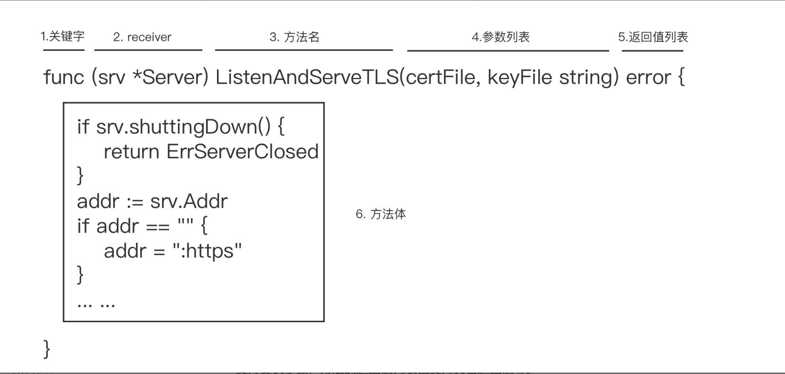


receiver 参数：方法必须归属一个类型

```go
//  【*T或T】称为基类型，只能有一个 receiver 参数
func (t *T或T) MethodName(参数列表) (返回值列表) {
    // 方法体
}

// 方法接收器（receiver）参数、函数 / 方法参数，以及返回值变量对应的作用域范围，
// 都是函数 / 方法体对应的显式代码块
type T struct{}
func (t T) M(t string) { // 编译器报错：duplicate argument t (重复声明参数t)
    ... ...
}
```


receiver 参数的基类型本身不能为指针类型或接口类型

```go


type MyInt *int
func (r MyInt) String() string { // r的基类型为MyInt，编译器报错：invalid receiver type MyInt (MyInt is a pointer type)
    return fmt.Sprintf("%d", *(*int)(r))
}

type MyReader io.Reader
func (r MyReader) Read(p []byte) (int, error) { // r的基类型为MyReader，编译器报错：invalid receiver type MyReader (MyReader is an interface type)
    return r.Read(p)
}
```


方法声明要与 receiver 参数的基类型声明放在同一个包内

```go
// 第一个推论：我们不能为原生类型（诸如 int、float64、map 等）添加方法

func (i int) Foo() string { // 编译器报错：cannot define new methods on non-local type int
    return fmt.Sprintf("%d", i) 
}

// 第二个推论：不能跨越 Go 包为其他包的类型声明新方法

import "net/http"

func (s http.Server) Foo() { // 编译器报错：cannot define new methods on non-local type http.Server
}
```


### 调用方式

可以通过 *T 或 T 的变量实例调用该方法

```go

type T struct{}

func (t T) M(n int) {
}

func main() {
    var t T
    t.M(1) // 通过类型T的变量实例调用方法M

    p := &T{}
    p.M(2) // 通过类型*T的变量实例调用方法M
}
```


### 方法的本质是什么？


方法本质上也是函数


```go
type T struct { 
    a int // 可以为原生类型定义方法
}
func (t T) Get() int {  
    return t.a 
}
func (t *T) Set(a int) int { 
    t.a = a 
    return t.a 
}

// 等价转换:

// 类型T的方法Get的等价函数
func Get(t T) int {  
    return t.a 
}

// 类型*T的方法Set的等价函数
func Set(t *T, a int) int { 
    t.a = a 
    return t.a 
}
```


>   C++ 中的对象在调用方法时，编译器会自动传入指向对象自身的 this 指针作为方法的第一个参数
>
>   Go 方法中将 receiver 参数以第一个参数的身份并入到方法的参数列表中，由 Go 编译器在编译和生成代码时自动完成


#### 方法表达式（Method Expression）

```go
// 类型 T 只能调用 T 的方法集合（Method Set）中的方法，
// 同理类型 *T 也只能调用 *T 的方法集合中的方法

var t T
t.Get()
(&t).Set(1)

// 等价替换:

var t T
T.Get(t)
(*T).Set(&t, 1)
```


>   Method Expression 有些类似于 C++ 中的静态方法（Static Method）
>
>   C++ 中的静态方法在使用时，以该 C++ 类的某个对象实例作为第一个参数，
>
>   而 Go 语言的 Method Expression 在使用时，同样以 receiver 参数所代表的类型实例作为第一个参数


Go 语言中的方法的本质就是，一个以方法的 receiver 参数作为第一个参数的普通函数

```go
// 方法自身的类型就是一个普通函数的类型，我们甚至可以将它作为右值，赋值给一个函数类型的变量
var t T
f1 := (*T).Set // f1的类型，也是*T类型Set方法的类型：func (t *T, int)int
f2 := T.Get    // f2的类型，也是T类型Get方法的类型：func(t T)int
fmt.Printf("the type of f1 is %T\n", f1) // the type of f1 is func(*main.T, int) int
fmt.Printf("the type of f2 is %T\n", f2) // the type of f2 is func(main.T) int
f1(&t, 3)
fmt.Println(f2(t)) // 3
```


### 巧解难题

问题代码：

```go
package main
import (
    "fmt"
    "time"
)
type field struct {
    name string
}
func (p *field) print() {
    fmt.Println(p.name)
}
func main() {
    data1 := []*field{{"one"}, {"two"}, {"three"}}
    for _, v := range data1 {
        go v.print()
    }
    data2 := []field{{"four"}, {"five"}, {"six"}}
    for _, v := range data2 {
        go v.print()
    }
    time.Sleep(3 * time.Second)
}

// 输出 （具体需要看 goroutine 的调度）
one
two
three
six
six
six
```

利用 Method Expression 方式，等价变换：

```go
type field struct {
    name string
}
func (p *field) print() {
    fmt.Println(p.name)
}
func main() {
    data1 := []*field{{"one"}, {"two"}, {"three"}}
    for _, v := range data1 {
        // 每次传入指针地址
        go (*field).print(v) 
    }
    data2 := []field{{"four"}, {"five"}, {"six"}}
    for _, v := range data2 {
        // 与 print 的 receiver 参数类型不同，因此需要将其取地址后再传入 (*field).print 函数。
        // 这样每次传入的 &v 实际上是变量 v 的地址
        // 详见 #循环变量的重用
        go (*field).print(&v) 
    }
    time.Sleep(3 * time.Second)
}

// 修改后：
type field struct {
    name string
}
func (p field) print() { // receiver 类型由 *field 改为 field
    fmt.Println(p.name)
}
func main() {
    data1 := []*field{{"one"}, {"two"}, {"three"}}
    for _, v := range data1 {
        go v.print()
    }
    data2 := []field{{"four"}, {"five"}, {"six"}}
    for _, v := range data2 {
        go v.print()
    }
    time.Sleep(3 * time.Second)
}

// 输出
one
two
three
four
five
six
```


### Q&A

>   Q：go方法的本质是一个以方法的 receiver 参数作为第一个参数的普通函数 函数是第一等公民，那大家都写函数就行了，方法存在的意义是啥呢？
>
>   A：你这个问题很好👍。 
>
>   我可以将其转换为另外一个几乎等价的问题：我们知道c++的方法(成员函数)本质就是以编译器插入的一个this指针作为首个参数的普通函数。那么大家为什么不直接用c的函数，非要用面向对象的c++呢？
>
>   其实你的问题本质上是一个编程范式演进的过程。Go类型+方法(类比于c++的类+方法)和oo范式一样，是一种“封装”概念的实现，即隐藏自身状态，仅提供方法供调用者对其状态进行正确改变操作，防止其他事物对其进行错误的状态改变操作。


## 方法集合与如何选择 receiver 类型


Go 方法实质上是以方法的 receiver 参数作为第一个参数的普通函数

```go
// 等价转换：
func (t T) M1() <=> F1(t T) 	// 值拷贝传递，t 是 T 类型实例的副本
func (t *T) M2() <=> F2(t *T) 	// *T 类型实例,t 是 T 类型实例的地址
```


选择不同类型对原类型实例的影响

```go
package main
  
type T struct {
    a int
}
func (t T) M1() {
    t.a = 10
}
func (t *T) M2() {
    t.a = 11
}

func main() {
    var t T
    println(t.a) // 0

    t.M1()
    println(t.a) // 0

    p := &t
    p.M2()
    println(t.a) // 11
}
```


### 选择 receiver 参数类型的原则


**原则一：**

要把对 receiver 参数代表的类型**实例的修改**，反映到原类型实例上，**选择 *T** 作为 receiver 参数的类型。

```go
type T struct {
	a int
}
func (t T) M1() {
	t.a = 10
}
func (t *T) M2() {
	t.a = 11
}
 
// Go 编译器会自动转换，
// 所以无论是 T 类型实例，还是 *T 类型实例，
// 都既可以调用 receiver 为 T 类型的方法，
// 也可以调用 receiver 为 *T 类型的方法：
func main() {
	var t1 T
	println(t1.a) // 0
	t1.M1()
	println(t1.a) // 0
	t1.M2()					// Go 编译器自动转换（将t1.M2()转换为(&t1).M2()）
	println(t1.a) // 11
 
	var t2 = &T{}
	println(t2.a) // 0
	t2.M1() 				// Go 编译器自动转换（将t2.M1()转换为(*t2).M1()）
	println(t2.a) // 0
	t2.M2()
	println(t2.a) // 11
}
```


**原则二：**


尽量**减少暴露**可以修改类型内部状态的方法，不需要在方法中对类型实例进行修改时，**选择 T 类型**。


**原则三：**


根据方法集合原理，聚焦于这个类型与接口类型间的耦合关系。


如果 T 类型需要**实现某个接口**，就使用 T 类型，T 不需要实现某接口，但 *T 需要，则参考原则一二即可。


```go
// 如果 T 类型需要实现某个接口的含义，

var i I 	// 一个接口类型I
var t T		// 一个自定义非接口类型T
i = t		// 希望这段代码是OK的

// 如果是*T实现了I，那么不能保证T也会实现I（因为*T的方法有可能更多）。
// 所以我们在设计一个自定义类型T的方法时，考虑是否T需要实现某个接口。
// 如果需要，方法receiver参数的类型应该是T。如果T不需要，那么用*T或T就都可以了。
```


>方法接收者类型选择三个原则
>
>1.   如果需要修改接收者本身，传指针 *T 
>
>2.   如果接受者本身较为复杂，传指针 *T，避免拷贝
>
>3.   *T的方法集合是包含 T 的方法集合。
>		 *T 范围更大 
>
>go 文档不推荐混合使用，一般还是用 T* 吧。除非明确需要不改动 T 本身


一个方法集合的例子：

```go
type Interface interface {
    M1()
    M2()
}

type T struct{}

func (t T) M1()  {}
func (t *T) M2() {}

func main() {
    var t T
    var pt *T
    dumpMethodSet(t)
    dumpMethodSet(pt)
    
    var i Interface
    i = pt
    i = t // cannot use t (type T) as type Interface in assignment: T does not implement Interface (M2 method has pointer receiver)
}

// 输出

main.T's method set:
- M1

*main.T's method set:
- M1
- M2
```


### 方法集合（Method Set）


方法集合是用来判断一个类型是否实现了某接口类型的唯一手段

```go
func dumpMethodSet(i interface{}) {
    dynTyp := reflect.TypeOf(i)

    if dynTyp == nil {
        fmt.Printf("there is no dynamic type\n")
        return
    }

    n := dynTyp.NumMethod()
    if n == 0 {
        fmt.Printf("%s's method set is empty!\n", dynTyp)
        return
    }

    fmt.Printf("%s's method set:\n", dynTyp)
    for j := 0; j < n; j++ {
        fmt.Println("-", dynTyp.Method(j).Name)
    }
    fmt.Printf("\n")
}


type T struct{}

func (T) M1() {}
func (T) M2() {}

func (*T) M3() {}
func (*T) M4() {}

func main() {
    var n int
    dumpMethodSet(n)
    dumpMethodSet(&n)

    var t T
    dumpMethodSet(t)
    dumpMethodSet(&t)
}

// 输出

int's method set is empty!		// Go 原生类型由于没有定义方法，方法集合是空的
*int's method set is empty!		// Go 原生类型由于没有定义方法，方法集合是空的

// 自定义类型 T 定义了方法 M1 和 M2
main.T's method set:
- M1
- M2

// *T 类型的方法集合包含所有以 *T ，以及所有以 T 为 receiver 参数类型的方法
*main.T's method set:	
- M1
- M2
- M3
- M4
```


### Q&A

```go
type T struct{}
func (T) M1()
func (T) M2()

// S 类型包含哪些方法？   *S 类型又包含哪些方法？
type S T

// 答：
// S 类型 和 *S 类型都没有包含方法，因为type S T 定义了一个新类型。
// 但是如果用 type S = T 则S和*S类型都包含两个方法
```


## 用**类型嵌入**模拟实现“继承”


**类型嵌入（Type Embedding）**：

-   接口类型的类型嵌入
-   结构体类型的类型嵌入


### 接口类型的类型嵌入


```go
// 接口类型声明了由一个方法集合代表的接口
// 如果某个类型实现了方法 M1 和 M2，我们就说这个类型实现了 E 所代表的接口
type E interface {	
    M1()
    M2()
}

// 等价 I ：
type I interface {
    M1()
    M2()
    M3()
}
type I interface {
    E 	// 会将嵌入的接口类型（如接口类型 E）的方法集合，并入到自己的方法集合中。（惯用法）
    M3()
}
```


Go 标准库中的例子

```go
// $GOROOT/src/io/io.go
type Reader interface {
    Read(p []byte) (n int, err error)
}
type Writer interface {
    Write(p []byte) (n int, err error)
}
type Closer interface {
    Close() error
}

type ReadWriter interface {
    Reader
    Writer
}
type ReadCloser interface {
    Reader
    Closer
}
type WriteCloser interface {
    Writer
    Closer
}
type ReadWriteCloser interface {
    Reader
    Writer
    Closer
}
```


Go 1.14 版本之前是有约束的，嵌入的接口类型的方法集合不能有交集：

Go 1.14 版本开始就[去除了这个限制](https://go-review.googlesource.com/c/go/+/190378)，变为并集(union)

```go
type Interface1 interface {
    M1()
}
type Interface2 interface {
    M1()
    M2()
}
type Interface3 interface {
    Interface1
    Interface2 // Error: duplicate method M1
}
type Interface4 interface {
    Interface2
    M2() // Error: duplicate method M2
}
func main() {
}
```


### 结构体类型的类型嵌入

```go
type S struct {
    A int
    b string
    c T
    p *P
    _ [10]int8
    F func()
}

// 带有嵌入字段（Embedded Field）的结构体定义 
type T1 int
type t2 struct{
    n int
    m int
}
type I interface {
    M1()
}
type S1 struct {
    T1			// T1、t2、I 既代表字段的名字，也代表字段的类型
    *t2
    I            
    a int
    b string
}
```


和 receiver 的基类型一样，嵌入字段类型的底层类型**不能为指针类型**

用法：

```go
type MyInt int
func (n *MyInt) Add(m int) {
    *n = *n + MyInt(m)
}

type t struct {
    a int
    b int
}
type S struct {
    *MyInt
    t
    io.Reader	// 规定如果结构体使用从其他包导入的类型作为嵌入字段，名字为不带包名
    s string
    n int
}

func main() {
    m := MyInt(17)
    r := strings.NewReader("hello, go")
    s := S{
        MyInt: &m,
        t: t{
            a: 1,
            b: 2,
        },
        Reader: r,	// 例如这里的 Reader
        s:      "demo",
    }
    
    var sl = make([]byte, len("hello, go"))
    s.Reader.Read(sl)
    fmt.Println(string(sl)) // hello, go
    s.MyInt.Add(5)
    fmt.Println(*(s.MyInt)) // 22
}
```


也可以利用组合思想实现继承功能

```go
// Go 发现结构体类型 S 自身并没有定义 Read 方法，
// 于是 Go 会查看 S 的嵌入字段对应的类型是否定义了 Read 方法
// 嵌入字段 Reader 的 Read 方法就被提升为 S 的方法，放入了类型 S 的方法集合

var sl = make([]byte, len("hello, go"))
s.Read(sl)  // 结构体类型 S“继承”了 Reader 字段的方法 Read 的实现
fmt.Println(string(sl))
s.Add(5) 	// 也“继承”了 *MyInt 的 Add 方法的实现
fmt.Println(*(s.MyInt))
```


更具体点，它是一种组合中的代理（delegate）模式

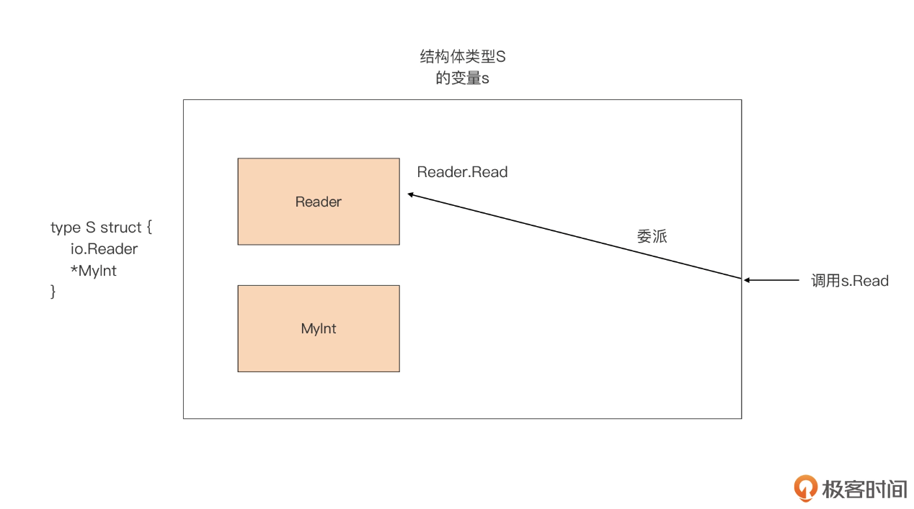


### 类型嵌入与方法集合


结构体类型中嵌入接口类型

```go
type I interface {
    M1()
    M2()
}
type T struct {
    I
}
func (T) M3() {}

func main() {
    var t T
    var p *T
    dumpMethodSet(t)
    dumpMethodSet(p)
}

// 输出    
// 结构体类型的方法集合，包含嵌入的接口类型的方法集合。
main.T's method set: 
- M1
- M2
- M3

*main.T's method set:
- M1
- M2
- M3
```


当结构体嵌入的多个接口类型的方法集合存在交集时，也有可能出现错误提示，因为编译器出现了分歧

```go
type E1 interface {
	M1()
	M2()
	M3()
}
type E2 interface {
	M1()
	M2()
	M4()
}
type T struct {
	E1
	E2
}
func main() {
	t := T{}
	t.M1()
	t.M2()
}

// 输出

main.go:22:3: ambiguous selector t.M1
main.go:23:3: ambiguous selector t.M2

// 解决方案：

type T struct {
    E1
    E2
}

func (T) M1() { println("T's M1") }
func (T) M2() { println("T's M2") }

func main() {
    t := T{}
    t.M1() // T's M1
    t.M2() // T's M2
}
```


妙用：简化单元测试的编写

```go
package employee
  
type Result struct {
    Count int
}
func (r Result) Int() int { return r.Count }

type Rows []struct{}

type Stmt interface {
    Close() error
    NumInput() int
    Exec(stmt string, args ...string) (Result, error)
    Query(args []string) (Rows, error)
}

// 返回男性员工总数
func MaleCount(s Stmt) (int, error) {
    result, err := s.Exec("select count(*) from employee_tab where gender=?", "1")
    if err != nil {
        return 0, err
    }

    return result.Int(), nil
}
```

单元测试：

```go
package employee
import "testing"

type fakeStmtForMaleCount struct {
    Stmt
}
func (fakeStmtForMaleCount) Exec(stmt string, args ...string) (Result, error) {
    return Result{Count: 5}, nil
}

func TestEmployeeMaleCount(t *testing.T) {
    f := fakeStmtForMaleCount{}
    c, _ := MaleCount(f)
    if c != 5 {
        t.Errorf("want: %d, actual: %d", 5, c)
        return
    }
}
```


### 结构体类型中嵌入结构体类型


无论是 T 类型的变量实例还是 *T 类型变量实例，都可以调用所有“继承”的方法

但带有嵌入类型的新类型究竟“继承”了哪些方法？

```go
type T1 struct{}
func (T1) T1M1()   { println("T1's M1") }
func (*T1) PT1M2() { println("PT1's M2") }

type T2 struct{}
func (T2) T2M1()   { println("T2's M1") }
func (*T2) PT2M2() { println("PT2's M2") }

type T struct {
    T1
    *T2
}

func main() {
    t := T{
        T1: T1{},
        T2: &T2{},
    }
    dumpMethodSet(t)
    dumpMethodSet(&t)
}

// 输出

// 类型 T 的方法集合 = T1 的方法集合 + *T2 的方法集合
main.T's method set:
- PT2M2
- T1M1
- T2M1

// 类型 *T 的方法集合 = *T1 的方法集合 + *T2 的方法集合
*main.T's method set:
- PT1M2
- PT2M2
- T1M1
- T2M1
```


### defined 类型与 alias 类型的方法集合


基于自定义非接口类型的 **defined 类型**的方法集合为空，没有“继承”这一隐式关联


defined 语法：

```go
type I interface {
    M1()
    M2()
}
type T int
type NT T // 基于已存在的类型T创建新的defined类型NT
type NI I // 基于已存在的接口类型I创建新defined接口类型NI
```

defined 例子：

```go
package main

type T struct{}
func (T) M1()  {}
func (*T) M2() {}

type T1 T // defined 

func main() {
  var t T
  var pt *T
  var t1 T1
  var pt1 *T1

  dumpMethodSet(t)
  dumpMethodSet(t1)
  dumpMethodSet(pt)
  dumpMethodSet(pt1)
}

// 输出

main.T's method set:
- M1

main.T1's method set is empty!

*main.T's method set:
- M1
- M2

*main.T1's method set is empty!
```


基于**类型别名（type alias）**定义的新类型，都与原类型拥有完全相同的方法集合

例子：

```go
type T struct{}
func (T) M1()  {}
func (*T) M2() {}

type T1 = T // type alias

func main() {
    var t T
    var pt *T
    var t1 T1
    var pt1 *T1

    dumpMethodSet(t)
    dumpMethodSet(t1)

    dumpMethodSet(pt)
    dumpMethodSet(pt1)
}

// 输出  // 输出的都是原类型的方法集合

main.T's method set:
- M1

main.T's method set:
- M1

*main.T's method set:
- M1
- M2

*main.T's method set:
- M1
- M2
```


### Q&A


``` go
// Q：S1 S2 是否等价？
type T1 int
type t2 struct{
    n int
    m int
}
type I interface {
    M1()
}

type S1 struct { 
    T1			// “语法糖”，无需再在外层结构上重新定义方法并代理给内部字段
    *t2
    I
    a int
    b string
}
type S2 struct { 
    T1 T1		// 能力上讲没有本质区别，只是需要在外层封一层方法，然后调用字段对应的方法
    t2 *t2
    I  I
    a  int
    b  string
}

// A：不等价，S2 结构体没有代理嵌入类型方法
```


