[TOC]

# 基础


## 变量声明


### 通用变量声明方法


### 不赋初值的话默认零值


### 变量声明支持

- 变量声明块（block）

  ```go
  var ( 
  	a int = 128 
  	...
  )
  ```

- 一行声明多个变量

  ```go
  var a, b, c int = 5, 6, 7
  ```

- 以上混合

  ```go
  var ( 
  	a, b, c int = 5, 6, 7
  	c, d, e rune = 'C', 'D', 'E'
  )
  ```


### 语法糖支持

- 省略类型信息声明

  ```go
  var b = 13
  // 或者不接受默认类型，进行显示类型转型
  var b = int32(13)
  ```

- 短变量声明

  ```
  a := 12
  ```


### 包级变量的声明形式

- 推荐的方式（声明聚类与就近原则，声明一致性）

  ```go
  // 声明但延迟初始化
  var ( 
  	netGo bool 
  	netCgo bool 
  )
  // 声明并同时显式初始化（声明一致性）
  var (
  	a = 13
  	b = int32(17)
  	f = float32(3.14)
  )
  ```

### 局部变量的声明形式

- 推荐的方式

  ```go
  // 延迟初始化（采用通用声明）
  var err error
  // 显式初始化（采用短变量）
  a := 17
  f := 3.14
  // 不接受默认类型（采用短变量）
  a := int32(17)
  f := float32(3.14)
  // 分支控制（采用短变量）
  for _, c := range chars {...}
  ```

### 总结


## 代码块与作用域


### 代码块与隐式代码块


### 预定义标识符（宇宙隐式代码块的标识符）


### 包级标识符

- 包顶层声明中的常量、类型、变量或函数（不包括方法）

### 文件代码块标识符

- 导入的包名

### 函数 / 方法体中

- 大括号作为范围界定


tips：控制语句隐式代码块：

```go
// 隐式
if a := 1; false { 
	
} else if b := 2; false {
	
}

// 转换成显式

{ // 等价于第一个if的隐式代码块
    a := 1 // 变量a作用域始于此
    if false {

    } else {
        { // 等价于第一个else if的隐式代码块
            b := 2 // 变量b的作用域始于此
            if false {

            }
            // 变量b的作用域终止于此
        }
    }
    // 变量a作用域终止于此
}
```


### 避免变量遮蔽的原则


可能出现的问题：

- 遮蔽预定义标识符
- 遮蔽包代码块中的变量
- 遮蔽外层显式代码块中的变量


tips：短变量声明与控制语句的结合十分容易导致变量遮蔽问题，并且很不容易识别

可以利用工具**辅助**检测变量遮蔽问题，例如`go vet`


## 基本数据类型


### 整型


#### 平台无关整形


> go 采用2的补码作为整形的比特位编码方法
>
> 


#### 平台相关整形


#### 整型的溢出问题

```go
var s int8 = 127
s += 1 // 预期128，实际结果-128

var u uint8 = 1
u -= 2 // 预期-1，实际结果255
```

tips：容易发生在循环语句的结束条件判定


#### 字面值与格式化输出

早期版本

```go
a := 53        // 十进制
b := 0700      // 八进制，以"0"为前缀
c1 := 0xaabbcc // 十六进制，以"0x"为前缀
c2 := 0Xddeeff // 十六进制，以"0X"为前缀
```

1.13 增加

```go
d1 := 0b10000001 // 二进制，以"0b"为前缀
d2 := 0B10000001 // 二进制，以"0B"为前缀
e1 := 0o700      // 八进制，以"0o"为前缀
e2 := 0O700      // 八进制，以"0O"为前缀

// 数字分隔符
a := 5_3_7		// 十进制: 537
```

标准库 fmt 包

```go
var a int8 = 59
fmt.Printf("%b\n", a) //输出二进制：111011
fmt.Printf("%d\n", a) //输出十进制：59
fmt.Printf("%o\n", a) //输出八进制：73
fmt.Printf("%O\n", a) //输出八进制(带0o前缀)：0o73
fmt.Printf("%x\n", a) //输出十六进制(小写)：3b
fmt.Printf("%X\n", a) //输出十六进制(大写)：3B
```


### 浮点型

#### 平台无关

- float32
- float64

#### 二进制表示


#### 转换成二进制例子

```go
有一个整数：139.8125

1.分别把整数部分和小数部分转换成二进制形式：
	整数部分：139d => 10001011b
	小数部分：0.8125d => 0.1101b（乘 2 取整）
	139.8125d=10001011.1101b
2.移动小数点直到只有一个1
	10001011.1101b => 1.00010111101b 
	移动了7位（指数7），尾数为00010111101b
3.计算阶码
	转换过程：阶码 = 指数 + 偏移值
	(偏移值计算：2^(e-1)-1，e=阶码部分的 bit 位数)
	阶码 = 7 + 127 = 134d = 10000110b
4.各自归位（见下图），得到最终二进制表示
	（尾数位数不足 23 位，可在后面补 0）
	最终浮点数 139.8125d 的二进制表示就为：
	0b_0_10000110_00010111101_000000000000
```


#### 字面值与格式化输出

字面值

```go
3.1415
.15  // 整数部分如果为0，整数部分可以省略不写
81.80
82. // 小数部分如果为0，小数点后的0可以省略不写

// 十进制科学计数法（e底数为10）
6674.28e-2 // 6674.28 * 10^(-2) = 66.742800
.12345E+5  // 0.12345 * 10^5 = 12345.000000

// 十六进制科学计数法（p底数为2）
0x2.p10  // 2.0 * 2^10 = 2048.000000
0x1.Fp+0 // 1.9375 * 2^0 = 1.937500
```

格式化输出

```go
fmt.Printf("%e\n", f) // 1.234568e+02		十进制科学计数法
fmt.Printf("%x\n", f) // 0x1.edd3be22e5de1p+06	十六进制科学计数法
```


### 复数类型

#### 平台无关

- complex64（实虚都为float32）
- complex128（实虚都为float64）

#### 字面值与格式化输出

```go
// 通过复数字面值初始化
var c = 5 + 6i
var d = 0o123 + .12345E+5i // 83+12345i

// complex 函数
var c = complex(5, 6) // 5 + 6i
var d = complex(0o123, .12345E+5) // 83+12345i

// 预定义函数 real 和 imag
var c = complex(5, 6) // 5 + 6i
r := real(c) // 5.000000
i := imag(c) // 6.000000
```

格式化输出：参考 float


### 自定义数值类型

#### type 关键字

基于原生数值类型

```go
// 例子：
type MyInt int32

// 类型安全规则
var m int = 5
var n int32 = 6
var a MyInt = m // 错误：在赋值中不能将m（int类型）作为MyInt类型使用
var a MyInt = n // 错误：在赋值中不能将n（int32类型）作为MyInt类型使用

// 显示转型解决上面问题
var m int = 5
var n int32 = 6
var a MyInt = MyInt(m) // ok
var a MyInt = MyInt(n) // ok
```

#### 类型别名（初衷是重构）

与type关键字可以互相替换

```go
type MyInt = int32

var n int32 = 6
var a MyInt = n // ok
```


tips：

开发生产中尽量不用浮点

tips2：

```go
// 容易混淆：
type MyInt int32	// 自定义新类型 MyInt
type MyInt = int32	// 与 int32 完全等价，可以直接相互赋值和运算
```


### 字符串类型


> 非原生问题：需要注意类型安全、防止缓冲区溢出、同步问题、获取长度代价大、非ASCII字符支持


自带原生字符串类型：string


优点：

- 数据不可变，提升并发安全性与存储利用率
- 获取长度时间复杂度为常数级
- 所见即所得（不会进行转义）
- 默认采用 Unicode 字符集，UTF-8 编码


字节序列

```go
var s = "中国人"
fmt.Printf("the length of s = %d\n", len(s)) // 9

for i := 0; i < len(s); i++ {
  fmt.Printf("0x%x ", s[i]) // 0xe4 0xb8 0xad 0xe5 0x9b 0xbd 0xe4 0xba 0xba
}
fmt.Printf("\n")
```

字符序列   （Unicode 字符集的码点）

```go
var s = "中国人"
fmt.Println("the character count in s is", utf8.RuneCountInString(s)) // 3

for _, c := range s {
  fmt.Printf("0x%x ", c) // 0x4e2d 0x56fd 0x4eba
}
fmt.Printf("\n")
```


#### rune 类型与字符字面值

一个 rune 示例相当于一个 Unicode 字符，等价于 int32 类型

```go
// 字面值
'a'  // ASCII字符
'中' // Unicode字符集中的中文字符
'\n' // 换行字符
'\'' // 单引号字符

// Unicode 专用转义字符\u 或\U 作为前缀
'\u4e2d'     // 字符：中
'\U00004e2d' // 字符：中
'\u0027'     // 单引号字符

// 本质是整型数
'\x27'  // 使用十六进制表示的单引号字符
'\047'  // 使用八进制表示的单引号字符
```


#### 字符串字面值

```go
"abc\n"
"中国人"
"\u4e2d\u56fd\u4eba" // 中国人
"\U00004e2d\U000056fd\U00004eba" // 中国人
"中\u56fd\u4eba" // 中国人，不同字符字面值形式混合在一起
"\xe4\xb8\xad\xe5\x9b\xbd\xe4\xba\xba" // 十六进制表示的字符串字面值：中国人
```


实验

```go
// rune -> []byte
func encodeRune() { 
    var r rune = 0x4E2D
    fmt.Printf("the unicode charactor is %c\n", r) // 中
    buf := make([]byte, 3)
    _ = utf8.EncodeRune(buf, r) // 对rune进行utf-8编码
    fmt.Printf("utf-8 representation is 0x%X\n", buf) // 0xE4B8AD
} 
// []byte -> rune 
func decodeRune() {
    var buf = []byte{0xE4, 0xB8, 0xAD}         
    r, _ := utf8.DecodeRune(buf) // 对buf进行utf-8解码
    fmt.Printf("the unicode charactor after decoding [0xE4, 0xB8, 0xAD] is %s\n", string(r)) // 中
}
```


内部表示

```go
// $GOROOT/src/reflect/value.go

// StringHeader是一个string的运行时表示
type StringHeader struct {
    Data uintptr
    Len  int
}
```


#### 常见操作

下标操作

```go
var s = "中国人"
fmt.Printf("0x%x\n", s[0]) // 0xe4：字符“中” utf-8编码的第一个字节
```

字符迭代 - 常规 for 迭代

```go
var s = "中国人"
for i := 0; i < len(s); i++ {
  fmt.Printf("index: %d, value: 0x%x\n", i, s[i]) // index: 0, value: 0xe4
}
```

字符迭代 - for range 迭代

```go
var s = "中国人"
for i, v := range s {
    fmt.Printf("index: %d, value: 0x%x\n", i, v) // index: 0, value: 0x4e2d
}
```

字符串连接

```go
s := "Rob Pike, "
s = s + "Robert Griesemer, "
s += " Ken Thompson"
fmt.Println(s) // Rob Pike, Robert Griesemer, Ken Thompson
```

字符串比较 （= =、!= 、>=、<=、> 和 <）

```go
func main() {
        s1 := "世界和平"
        s2 := "世界" + "和平"
        fmt.Println(s1 == s2) // true

        s1 = "Go"
        s2 = "C"
        fmt.Println(s1 != s2) // true

        s1 = "12345"
        s2 = "23456"
        fmt.Println(s1 < s2)  // true  只判断第一个就短路返回
        fmt.Println(s1 <= s2) // true  只判断第一个就短路返回

        s1 = "12345"
        s2 = "123"
        fmt.Println(s1 > s2)  // true  判断到第四个才返回
        fmt.Println(s1 >= s2) // true  判断到第四个才返回
}
```

字符串转换（字符串转换有开销，因为 string 是不可变的，需要分配新内存）

```go
var s string = "中国人"
                      
// string -> []rune
rs := []rune(s) 
fmt.Printf("%x\n", rs) // [4e2d 56fd 4eba]
                
// string -> []byte
bs := []byte(s) 
fmt.Printf("%x\n", bs) // e4b8ade59bbde4baba
                
// []rune -> string
s1 := string(rs)
fmt.Println(s1) // 中国人
                
// []byte -> string
s2 := string(bs)
fmt.Println(s2) // 中国人
```

性能对比：

```go
strings.Builder > bytes.Buffer > “+” > fmt.Sprintf

// 确定长度的话可以使用 grows 方法提前申请空间，性能更好
```


## 常量

### const 关键字

只支持基本数据类型（数值、字符串、布尔）

```go
const Pi float64 = 3.14159265358979323846 // 单行常量声明

// 以const代码块形式声明常量
const (
    size int64 = 4096
    i, j, s = 13, 14, "bar" // 单行声明多个常量
)
```

#### 创新

- 无类型常量 + 隐式转型

  ```go
  type myInt int
  const n = 13
  
  func main() {
      var a myInt = 5
      fmt.Println(a + n)  // 输出：18
  }
  ```

- 实现枚举（隐式重复前一个非空表达式，iota 偏移量）

  ```go
  // $GOROOT/src/sync/mutex.go 
  const ( 
      mutexLocked = 1 << iota  	// 1 << 0 = 1  
      mutexWoken					// 1 << 1 = 2
      mutexStarving				// 1 << 2 = 4
      mutexWaiterShift = iota		// 3
      starvationThresholdNs = 1e6	// 1e6
  )
  
  const (
      _ = iota // iota 从0开始，空白标识符可以跳过
      Pin1
      Pin2
      _
      Pin4    // 4   
  )
  ```


## 同构复合类型


### 数组

```go
// T类型 长度L  长度编译时就需要确定
var arr [L]T

// T L 一致才类型等价
func foo(arr [5]int) {}
func main() {
    var arr1 [5]int
    var arr2 [6]int
    var arr3 [5]string
    
    foo(arr1) // ok
    foo(arr2) // 错误：[6]int与函数foo参数的类型[5]int不是同一数组类型
    foo(arr3) // 错误：[5]string与函数foo参数的类型[5]int不是同一数组类型
}

// 长度与内存大小（字节）
var arr = [6]int{1, 2, 3, 4, 5, 6}
fmt.Println("数组长度：", len(arr))           // 6
fmt.Println("数组大小：", unsafe.Sizeof(arr)) // 48

// 显式初始化
var arr2 = [6]int {
    11, 12, 13, 14, 15, 16,
} 
var arr3 = [...]int { 
    21, 22, 23,
} 
fmt.Printf("%T\n", arr3) // [3]int

// 下标赋值
var arr4 = [...]int{
    99: 39, // 将第100个元素(下标值为99)的值赋值为39，其余元素值均为0
}
fmt.Printf("%T\n", arr4) // [100]int
```


### 多维数组

```go
var mArr [2][3][4]int
```


### 切片

数组缺点：固定的元素个数，以及传值机制下导致的开销较大

切片优点：下标访问、边界溢出校验、动态扩容等

```go
// 初始化  比数据少了个长度
var nums = []int{1, 2, 3, 4, 5, 6}
fmt.Println(len(nums)) // 6

// “零值可用”（初值为零值 nil 的切片类型变量）
nums = append(nums, 7) // 切片变为[1 2 3 4 5 6 7]
fmt.Println(len(nums)) // 7
```

实现（内存布局）

```go
type slice struct {
    array unsafe.Pointer	// 是指向底层数组的指针
    len   int				// 长度（当前个数）
    cap   int				// 底层长度（最大容量）
}
```

其他创建切片方式

```go
// make
sl := make([]byte, 6, 10) 	// 其中10为cap值，即底层数组长度，6为切片的初始长度
sl := make([]byte, 6) 		// cap = len = 6

// 基于数组：array[low : high : max]   （相当于一个数组的窗口）
arr := [10]int{1, 2, 3, 4, 5, 6, 7, 8, 9, 10}
sl := arr[3:7:9]

sl[0] += 10
fmt.Println("arr[3] =", arr[3]) // 14

// 基于切片创建切片
s2 := make([]int, len(s1), (cap(s1))*2)
copy(s2,s1)  // 拷贝s2到s1
fmt.Printf("len=%d cap=%d slice=%v\n",len(s2),cap(s2),s2)
```

基于数组：

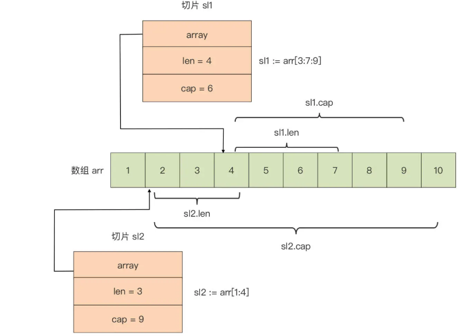


动态扩容

```go
var s []int
s = append(s, 11) 
fmt.Println(len(s), cap(s)) //1 1
s = append(s, 12) 
fmt.Println(len(s), cap(s)) //2 2
s = append(s, 13) 
fmt.Println(len(s), cap(s)) //3 4
s = append(s, 14) 
fmt.Println(len(s), cap(s)) //4 4
s = append(s, 15) 
fmt.Println(len(s), cap(s)) //5 8
```

tips：扩容时会分配新的数组，切片会与原数组解除“绑定”，注意别踩坑！


## 复合数据类型


### 原生 Map 类型

```go
// Go 语言中要求，key 的类型必须支持“==”和“!=”两种比较操作符
map[key_type]value_type

// 在 Go 语言中，函数类型、map 类型自身，以及切片
// 只支持与 nil 的比较，不支持同类型两个变量的比较
// 所以函数类型、map 类型自身，以及切片类型是不能作为 map 的 key 类型的
s := make([]int, 1)			// slice can only be compared to nil
f := func() {}				// func can only be compared to nil
m := make(map[int]string)	// map can only be compared to nil
```


初始化

```go
// 初始化
var m map[string]int // m = nil
// 无法“零值可用”
m["key"] = 1 // panic: assignment to entry in nil map


// “零值可用”（初值为零值 nil 的 map 类型变量）

// 方法1.复合字面值：
m := map[int]string{}

m1 := map[int][]string{
    1: []string{"val1_1", "val1_2"},
    7: []string{"val7_1"},
}

type Position struct { 
    x float64 
    y float64
}
m2 := map[Position]string{
    Position{29.935523, 52.568915}: "school",
    Position{73.224455, 111.804306}: "hospital",
}

// 语法糖：省略字面值中的元素类型
m2 := map[Position]string{
    {29.935523, 52.568915}: "school",
    {73.224455, 111.804306}: "hospital",
}

// 方法2.使用 make 初始化：
m1 := make(map[int]string) // 未指定初始容量
m2 := make(map[int]string, 8) // 指定初始容量为8
```


基本操作

```go
// 插入
m := make(map[int]string)
m[1] = "value1"

// 数量	（不能用 cap）
len(m)   

// 查找	（即使不存在，也会拿到零值）
v := m["key1"]

// 查找：comma ok 惯用法
v, ok := m["key1"]if !ok {}
// 直接判断是否存在
_, ok := m["key1"]

// 删除
delete(m, "key2")

// 遍历	（注意：map 是无序的）
for k, v := range m {}
for _, v := range m {}
for k:= range m {}
```


#### 实现（内存布局）

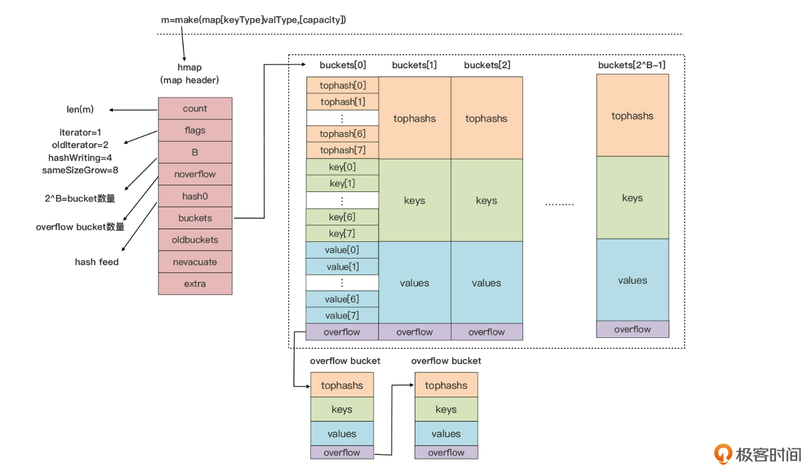

初始状态	（默认 bucket 为8，在 reflect.go 中定义）

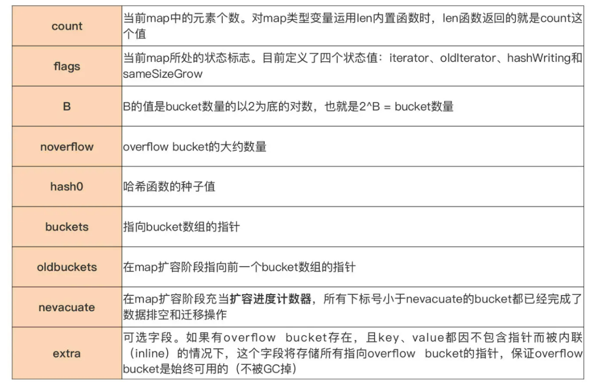

哈希处理（tophash 区域）

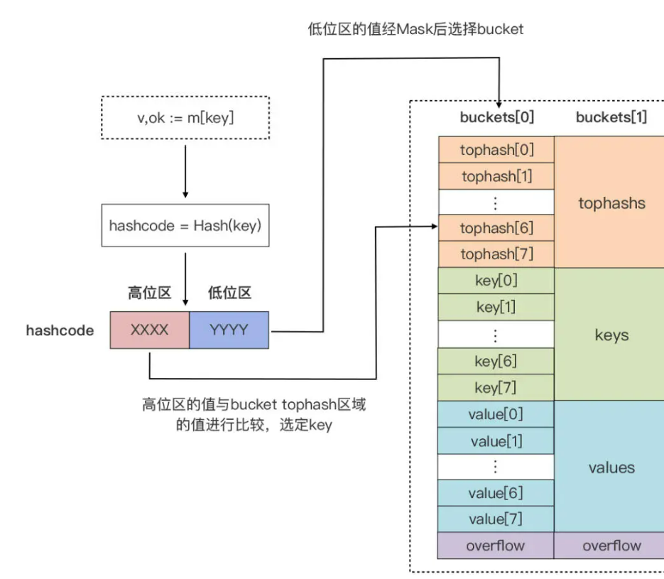

key 存储区域

```go
// 声明时生成 runtime.maptype 实例，包含所有元信息
// hash 函数在 maptype.key.alg.hash(key, hmap.hash0)
type maptype struct {
    typ        _type
    key        *_type
    elem       *_type
    bucket     *_type // internal type representing a hash bucket
    keysize    uint8  // size of key slot
    elemsize   uint8  // size of elem slot
    bucketsize uint16 // size of bucket
    flags      uint32
} 
```

value 存储区域

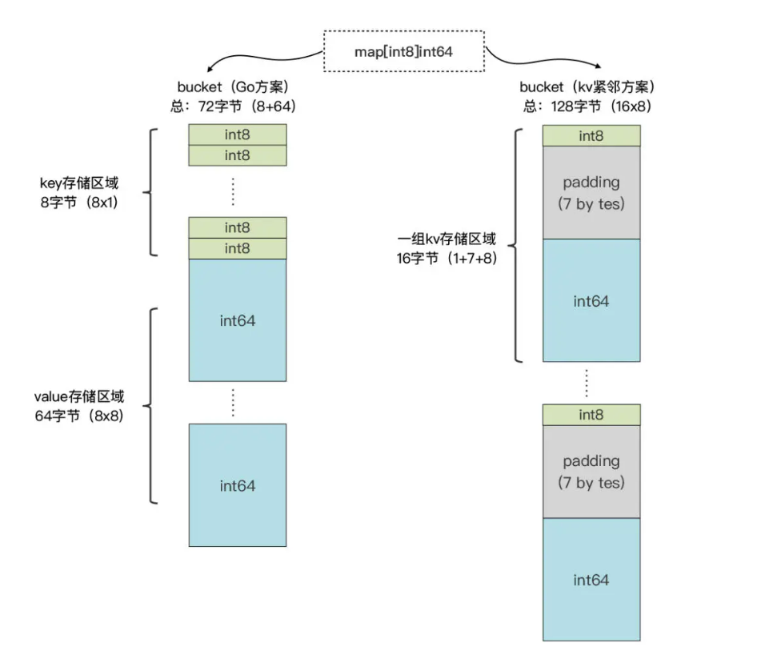

如果 key 或 value 的数据长度过大，那么运行时不会在 bucket 中直接存储数据，会存储 key 或 value 数据的指针，目前 Go 运行时定义的最大 key 和 value 长度：

```go
// $GOROOT/src/runtime/map.go
const (
    maxKeySize  = 128
    maxElemSize = 128
)
```

map 扩容

```go
// 扩容判定：count > LoadFactor * 2^B 或 overflow bucket 过多时
// 1.17 版本 LoadFactor 设置为 6.5（loadFactorNum/loadFactorDen）

// $GOROOT/src/runtime/map.go
const (
  ... ...

  loadFactorNum = 13
  loadFactorDen = 2
  ... ...
)

func mapassign(t *maptype, h *hmap, key unsafe.Pointer) unsafe.Pointer {
  ... ...
  if !h.growing() && (overLoadFactor(h.count+1, h.B) || tooManyOverflowBuckets(h.noverflow, h.B)) {
    hashGrow(t, h)
    goto again // Growing the table invalidates everything, so try again
  }
  ... ...
}
```

overflow bucket 过多时会在 assign 和 delete 时做排空和迁移（2倍扩容）

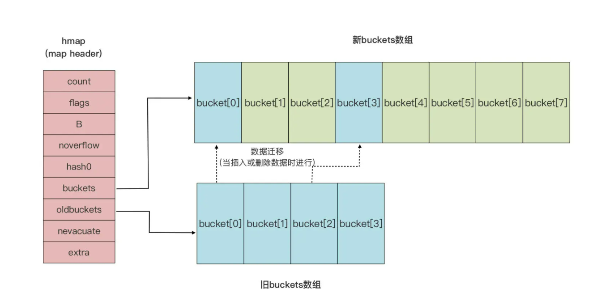


并发：无并发写保护，1.9引入并发写安全的 [sync.Map](https://pkg.go.dev/sync#Map)

```go
// 例子
package main
import (
    "fmt"
    "time"
)

func doIteration(m map[int]int) {
    for k, v := range m {
        _ = fmt.Sprintf("[%d, %d] ", k, v)
    }
}

func doWrite(m map[int]int) {
    for k, v := range m {
        m[k] = v + 1
    }
}

func main() {
    m := map[int]int{
        1: 11,
        2: 12,
        3: 13,
    }
    go func() {
        for i := 0; i < 1000; i++ {
            doIteration(m)
        }
    }()
    go func() {
        for i := 0; i < 1000; i++ {
            doWrite(m)
        }
    }()
    time.Sleep(5 * time.Second)
}

// 结果：
fatal error: concurrent map iteration and map write
```

其他

```go
// map 的自动扩容会导致 value 地址变化，
// 所以 Go 不允许获取 map 中 value 的地址

p := &m[key]  // cannot take the address of m[key]
fmt.Println(p)
```

```go
// map 是由 Go 编译器与运行时联合实现的。
// Go 编译器在编译阶段会将语法层面的 map 操作，重写为运行时对应的函数调用。
// Go 运行时则采用了高效的算法实现了 map 类型的各类操作

// 如何实现有序的功能：
// 把key存到有序切片中，用切片遍历
```

学习链接：[理解 Go Map 的原理](https://draveness.me/golang/docs/part2-foundation/ch03-datastructure/golang-hashmap/)


### 结构体 struct


定义新类型

```go
// 定义一个新类型 T，S 可以为原生类型或已有自定义类型
type T S 

// 底层类型（Underlying Type）用来判断两个类型本质上是否相同（Identical）
// 本质上相同的两个类型，它们的变量可以通过显式转型进行相互赋值
type T1 int
type T2 T1
type T3 string

func main() {
    var n1 T1
    var n2 T2 = 5
    n1 = T1(n2)  // ok
    
    var s T3 = "hello"
    n1 = T1(s) // 错误：cannot convert s (type T3) to type T1
}

// 基于字面值定义新类型 + type块定义
type (
   M map[int]string
   S []string
)

// 使用类型别名（Type Alias）定义新类型，通常用在项目的渐进式重构
type T = S  // 完全等价
```

定义结构体类型

```go
// 定义结构体类型
type T struct {
    Field1 T1
    Field2 T2
    ... ...
    FieldN Tn
}

// 空结构体类型
type Empty struct{} 
var s Empty
println(unsafe.Sizeof(s)) // 内存占用为0

// 空结构体元素作为一种“事件”信息进行 Goroutine 之间的通信
// 是内存占用最小的 Goroutine 间通信方式
var c = make(chan Empty) // 声明一个元素类型为Empty的channel
c<-Empty{}               // 向channel写入一个“事件”

// 嵌套结构体
type Person struct {
    Name string
}
type Book struct {
    Title string
    // Author Person
    Person  // 嵌入字段（Embedded Field）（匿名字段）
}

var book Book 
println(book.Person.Phone) // 将类型名当作嵌入字段的名字
println(book.Phone)        // 支持直接访问嵌入字段所属类型中字段

// 不可以递归嵌入（invalid recursive type T）
// 但可以拥有：
type T struct {
    t  *T           // 以自身类型的指针类型 ok 
    st []T          // 以自身类型为元素类型的切片类型 ok
    m  map[string]T // 以自身类型作为 value 类型的 map 类型的字段 ok
}     
```


零值不可用与零值可用

```go
// 零值无需初始化即可使用的例子：

var mu sync.Mutex
mu.Lock()
mu.Unlock()

var b bytes.Buffer
b.Write([]byte("Hello, Go"))
fmt.Println(b.String()) // 输出：Hello, Go
```


声明与初始化

```go
// 声明
var book Book
var book = Book{}
book := Book{}

// 显式初始化 （不推荐，go vet 工具还提供了检测规则 “composites”） 
var book = Book{"The Go Programming Language", 700, make(map[string]int)}

// 复合字面值初始化（“field:value”形式）未设置的默认零值
var t = T{
    F2: "hello",
    F1: 11,
}

// 结构体零值
t := T{}
// 少用的 new
tp := new(T)

// 特定的构造函数初始化 （例如在结构体包含未导出字段，并且为零值不可用的时候）
// 专用构造函数，例如： $GOROOT/src/time/sleep.go
func NewTimer(d Duration) *Timer {
    c := make(chan Time, 1)
    t := &Timer{
        C: c,
        r: runtimeTimer{
            when: when(d),
            f:    sendTime,
            arg:  c,
        },
    }
    startTimer(&t.r)
    return t
}

```

#### 实现（内存布局）

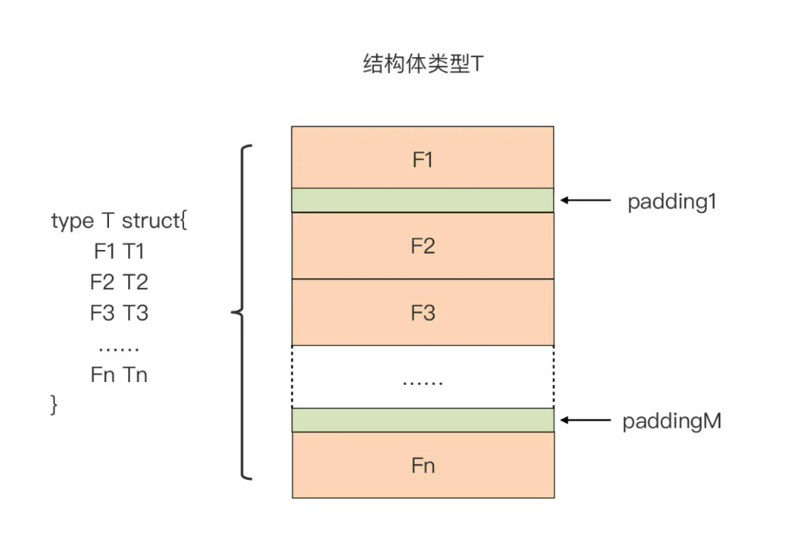

```go
var t T
unsafe.Sizeof(t)      // 结构体类型变量占用的内存大小
unsafe.Offsetof(t.Fn) // 字段Fn在内存中相对于变量t起始地址的偏移量
```


填充物（Padding），内存对齐例子：

```go
type T struct {
    b byte

    i int64
    u uint16
}
```

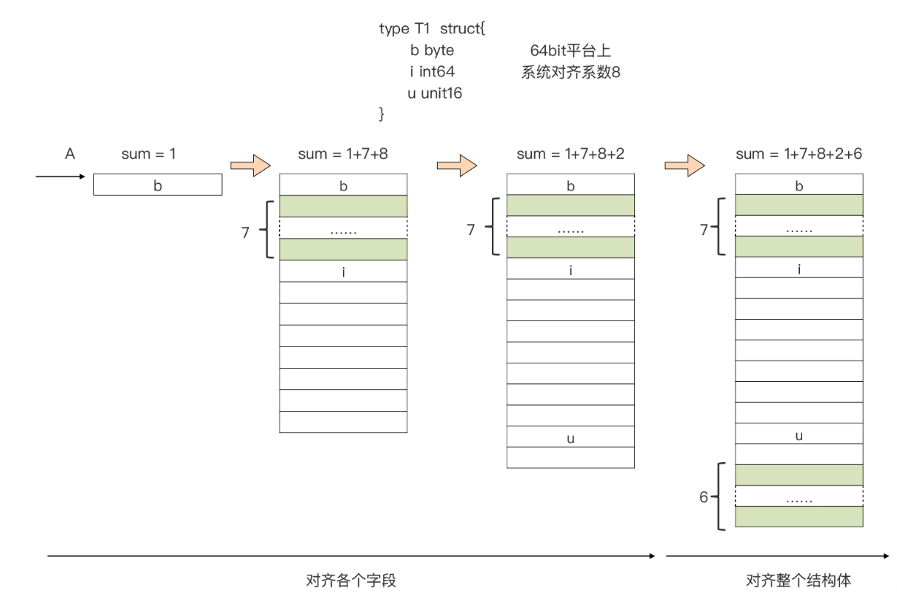

```go
// 平铺形式存放在连续内存块中(数组也是)

// 第一阶段：对齐结构体的各个字段
// 第二阶段：对齐整个结构体
// 个别处理器无法处理未对齐的数据，x86存取性能会受影响

// 不同顺序也会影响大小
type T struct {
    b byte
    i int64
    u uint16
}

type S struct {
    b byte
    u uint16
    i int64
}

func main() {
    var t T
    println(unsafe.Sizeof(t)) // 24
    var s S
    println(unsafe.Sizeof(s)) // 16
}
```

主动填充，例如 runtime 包中的 mstats

```go
// $GOROOT/src/runtime/mstats.go
type mstats struct {
    ... ...
    // Add an uint32 for even number of size classes to align below fields
    // to 64 bits for atomic operations on 32 bit platforms.
    _ [1 - _NumSizeClasses%2]uint32 // 这里做了主动填充

    last_gc_nanotime uint64 // last gc (monotonic time)
    last_heap_inuse  uint64 // heap_inuse at mark termination of the previous GC
    ... ...
}
```

学习链接：[struct 内存对齐](https://geektutu.com/post/hpg-struct-alignment.html)


## 控制结构：if


### if 语句

```go
if boolean_expression1 { 
    // 分支1
} if else boolean_expression2 { 
    // 分支2
} else { 
    // 分支3
}

// 等价于

if boolean_expression1 {
    // 分支1
} else {
    if boolean_expression2 {
       // 分支2
    } else { 
       // 分支3
    }
}
```


if 语句支持声明自用变量（惯用法）

```go
if a, c := f(), h(); a > 0 {
    println(a)
} else if b := f(); b > 0 {
    println(a, b)
} else {
    println(a, b, c)
}
```


### 逻辑操作符（最高优先级）

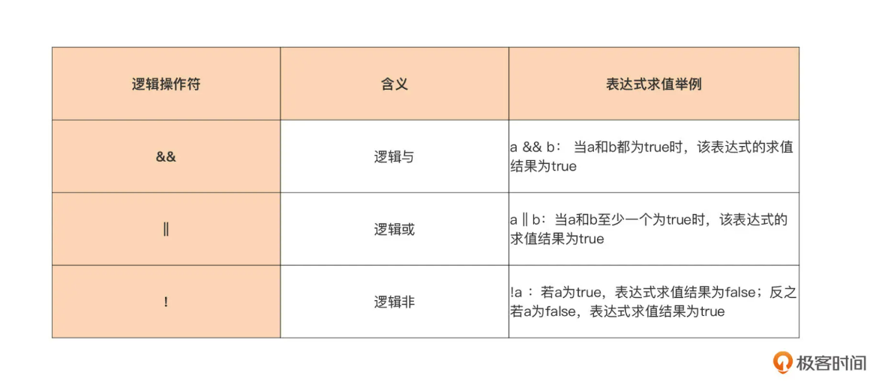

### 其他操作符

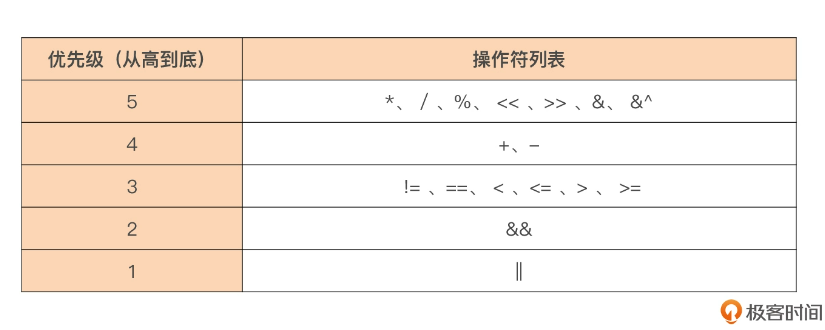

可以使用带有小括号的子布尔表达式来清晰表达判断条件


### “快乐路径（Happy Path）”原则

- 单分支结构
- 失败立即返回 
- 成功的逻辑始终“居左”并延续到函数结尾
- 代码扁平，无深度缩进


Tips：if命中排列（流水线技术和分支预测）


##  控制结构：for


### for 循环

```go
for preStmt; condition; postStmt { … }
```

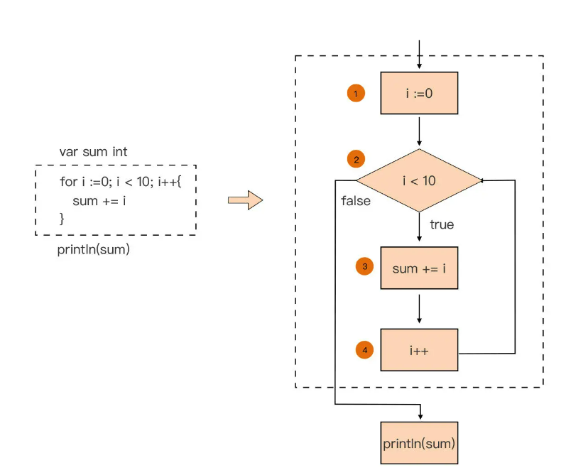

① 循环前置语句，仅执行一次
② 条件判断表达式
③ 循环体
④ 循环后置语句


for 支持声明多循环变量

```go
for i, j, k := 0, 1, 2; (i < 20) && (j < 10) && (k < 30); i, j, k = i+1, j+1, k+5 { 
    sum += (i + j + k) 
    println(sum)
}
```


循环体必须，其他可省略

```go
i := 0
for ; i < 10; {   // 省略前置+后置语句， 或写作 for i < 10 {}
    println(i) i++
}

for {    // 等同于 for true {} ，或写作 for ; ; {} 
    // 全省略，只剩下循环体
}
```


### for range 循环


go 自带针对切片与 string 等类型的 for 语法糖 for range ：


#### 切片类型

```go
var sl = []int{1, 2, 3, 4, 5}
for i := 0; i < len(sl); i++ {    
    fmt.Printf("sl[%d] = %d\n", i, sl[i])
}

for i, v := range sl {
    fmt.Printf("sl[%d] = %d\n", i, v)
}

// 变种1：只拿下标
for i := range sl {
}
// 变种2：只拿值
for _, v := range sl {
}
// 变种3：纯循环
for range sl {  // 等同于 for _, _ = range sl {}
}
```


#### string 类型

每次返回 rune 类型值

```go
var s = "中国人"
for i, v := range s {
    fmt.Printf("%d %s 0x%x\n", i, string(v), v)
}

// 输出：
0 中 0x4e2d
3 国 0x56fd
6 人 0x4eba

// i 为该 Unicode 字符码点的内存编码（UTF-8）的第一个字节在字符串内存序列中的位置

```


#### map 类型

```go
var m = map[string]int {
    "Rob" : 67,
    "Russ" : 39,
}

for k, v := range m {
    println(k, v)
}
```


#### channel 类型

channel 是 Go 语言提供的并发设计的原语，它用于多个 Goroutine 之间的通信

```go
var c = make(chan int)
for v := range c {
   // channel 关闭时循环才会结束，不然会阻塞在对 channel 的读操作上
}
```


#### continue 语句（支持 label）

continue：中断当前循环体，并继续下一次迭代

continue+label：一般用于跳转到外层循环并继续执行外层循环语句的下一个迭代

```go
	var sum int
	var sl = []int{1, 2, 3, 4, 5, 6}
	for i := 0; i < len(sl); i++ {
		if sl[i]%2 == 0 {
			continue // 忽略切片中值为偶数的元素
		}
		sum += sl[i]
	}
	println(sum) // 9

	// 等价于
	sum = 0
	sl = []int{1, 2, 3, 4, 5, 6}
loop:
	for i := 0; i < len(sl); i++ {
		if sl[i]%2 == 0 {
			continue loop // 忽略切片中值为偶数的元素
		}
		sum += sl[i]
	}
	println(sum) // 9
```


#### break 语句（支持 label）

break：跳出循环

break+label：同上，可以直接终结外层循环


#### 常见问题


##### 循环变量的重用

```go
func main() {
    var m = []int{1, 2, 3, 4, 5}  
             
    for i, v := range m {
        go func() {
            time.Sleep(time.Second * 3)
            fmt.Println(i, v)
        }()
    }
    time.Sleep(time.Second * 10)
}
// 隐式代码块转换后：
func main() {
    var m = []int{1, 2, 3, 4, 5}  
    {
      	i, v := 0, 0  // 循环变量在 for range 语句中仅会被声明一次
        for i, v = range m {
            go func() {
                time.Sleep(time.Second * 3)
                fmt.Println(i, v)
            }()
        }
    }
    time.Sleep(time.Second * 10)
}
// 运行结果：
4 5
4 5
...

// 修改成正确预期：
func main() {
    var m = []int{1, 2, 3, 4, 5}
    for i, v := range m {
        go func(i, v int) { // 创建时将参数与 i、v 的当时值进行绑定
            time.Sleep(time.Second * 3)
            fmt.Println(i, v)
        }(i, v)
    }
    time.Sleep(time.Second * 10)
}

```


##### 参与循环的是 range 表达式的副本

go 是值拷贝，range中也一样

```go
func main() {
    var a = [5]int{1, 2, 3, 4, 5}
    var r [5]int
    fmt.Println("original a =", a)
    for i, v := range a {
        if i == 0 {
            a[1] = 12
            a[2] = 13
        }
        r[i] = v
    }
    fmt.Println("after for range loop, r =", r)
    fmt.Println("after for range loop, a =", a)
}

// 使用切片优化：
func main() {
    var a = [5]int{1, 2, 3, 4, 5}
    var r [5]int
    fmt.Println("original a =", a)
    for i, v := range a[:] {
        if i == 0 {
            a[1] = 12
            a[2] = 13
        }
        r[i] = v
    }
    fmt.Println("after for range loop, r =", r)
    fmt.Println("after for range loop, a =", a)
}

// 或者用数组指针替换数组
```


##### 遍历 map 中元素的随机性

在循环过程中如果对map进行了修改，那么结果和遍历map一样具有随机性，可能成功也可能不成功

> map的遍历顺序有随机性。但这种随机仅仅是在创建初始iterator时随机选择一个bucket。
>
> 假设按bucket2->bucket3->...顺序迭代，假设已经遍历完bucket2，正在遍历bucket3，此时插入lucy这个key，恰插到bucket2中，由于之前已经遍历完bucket2，后续的遍历不会再重复遍历bucket2，于是lucy便无法出现在后续遍历路径上。如果lucy插入到bucket3后面的bucket中，则会出现在遍历路径上，我们就能看到这个key。
>
> key存储在哪里是根据hash值来定的


```go

```


```go

```


```go

```


