[TOC]

# 基础


## 变量声明


### 通用变量声明方法

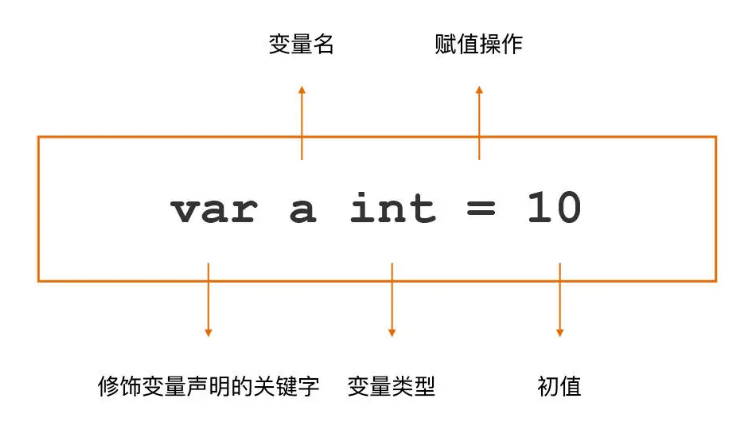

### 不赋初值的话默认零值

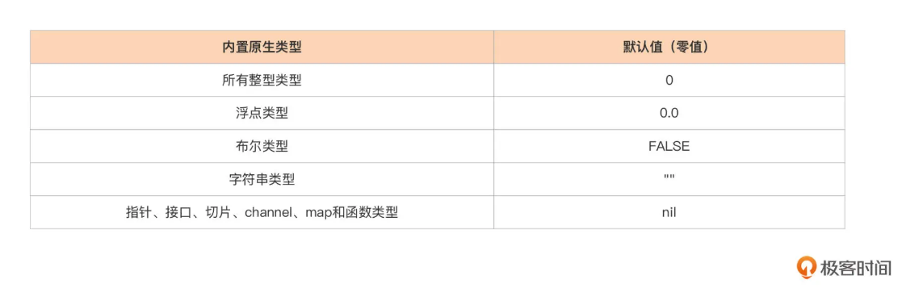

### 变量声明支持

- 变量声明块（block）

  ```go
  var ( 
  	a int = 128 
  	...
  )
  ```

- 一行声明多个变量

  ```go
  var a, b, c int = 5, 6, 7
  ```

- 以上混合

  ```go
  var ( 
  	a, b, c int = 5, 6, 7
  	c, d, e rune = 'C', 'D', 'E'
  )
  ```


### 语法糖支持

- 省略类型信息声明

  ```go
  var b = 13
  // 或者不接受默认类型，进行显示类型转型
  var b = int32(13)
  ```

- 短变量声明

  ```
  a := 12
  ```


### 包级变量的声明形式

- 推荐的方式（声明聚类与就近原则，声明一致性）

  ```go
  // 声明但延迟初始化
  var ( 
  	netGo bool 
  	netCgo bool 
  )
  // 声明并同时显式初始化（声明一致性）
  var (
  	a = 13
  	b = int32(17)
  	f = float32(3.14)
  )
  ```

### 局部变量的声明形式

- 推荐的方式

  ```go
  // 延迟初始化（采用通用声明）
  var err error
  // 显式初始化（采用短变量）
  a := 17
  f := 3.14
  // 不接受默认类型（采用短变量）
  a := int32(17)
  f := float32(3.14)
  // 分支控制（采用短变量）
  for _, c := range chars {...}
  ```

### 总结

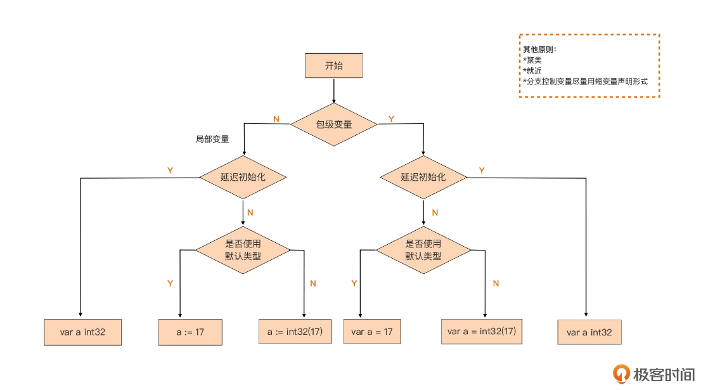


## 代码块与作用域


### 代码块与隐式代码块

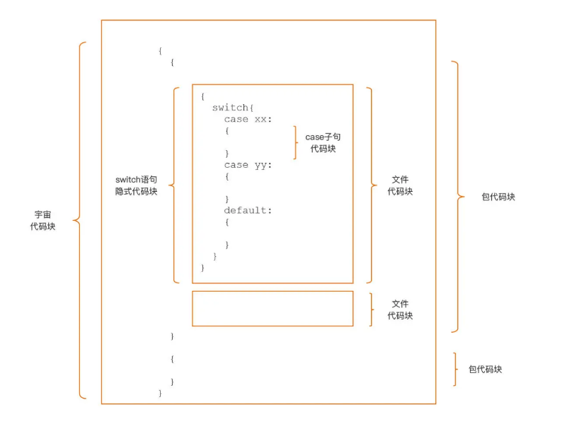


### 预定义标识符（宇宙隐式代码块的标识符）

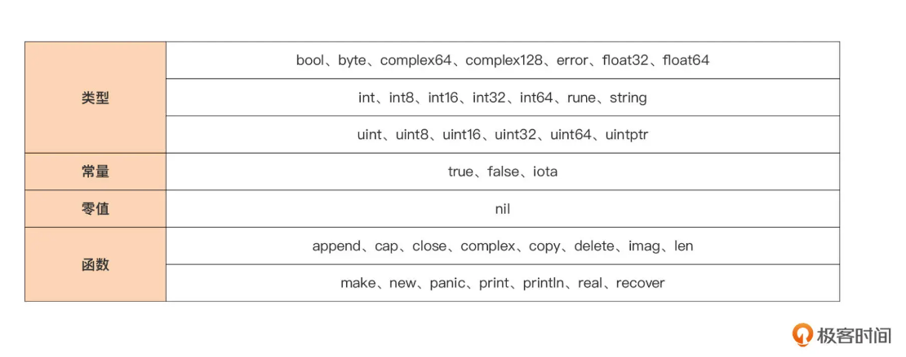

### 包级标识符

- 包顶层声明中的常量、类型、变量或函数（不包括方法）

### 文件代码块标识符

- 导入的包名

### 函数 / 方法体中

- 大括号作为范围界定


tips：控制语句隐式代码块：

```go
// 隐式
if a := 1; false { 
} else if b := 2; false {
}

// 转换成显式

{ // 等价于第一个if的隐式代码块
    a := 1 // 变量a作用域始于此
    if false {

    } else {
        { // 等价于第一个else if的隐式代码块
            b := 2 // 变量b的作用域始于此
            if false {

            }
            // 变量b的作用域终止于此
        }
    }
    // 变量a作用域终止于此
}
```


### 避免变量遮蔽的原则


可能出现的问题：

- 遮蔽预定义标识符
- 遮蔽包代码块中的变量
- 遮蔽外层显式代码块中的变量


tips：短变量声明与控制语句的结合十分容易导致变量遮蔽问题，并且很不容易识别

可以利用工具**辅助**检测变量遮蔽问题，例如`go vet`


## 基本数据类型


### 整型


#### 平台无关整形

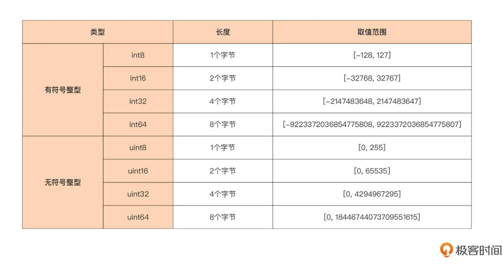

> go 采用2的补码作为整形的比特位编码方法
>
> 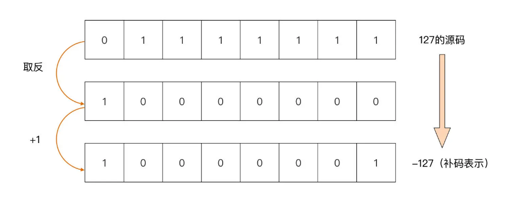


#### 平台相关整形

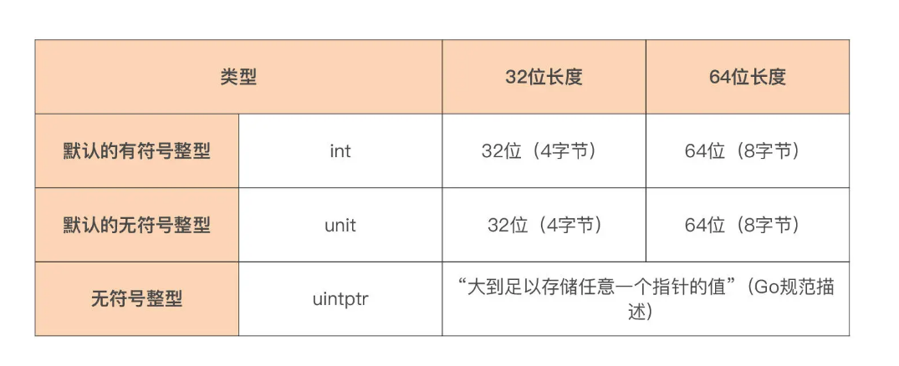


#### 整型的溢出问题

```go
var s int8 = 127
s += 1 // 预期128，实际结果-128

var u uint8 = 1
u -= 2 // 预期-1，实际结果255
```

tips：容易发生在循环语句的结束条件判定


#### 字面值与格式化输出

早期版本

```go
a := 53        // 十进制
b := 0700      // 八进制，以"0"为前缀
c1 := 0xaabbcc // 十六进制，以"0x"为前缀
c2 := 0Xddeeff // 十六进制，以"0X"为前缀
```

1.13 增加

```go
d1 := 0b10000001 // 二进制，以"0b"为前缀
d2 := 0B10000001 // 二进制，以"0B"为前缀
e1 := 0o700      // 八进制，以"0o"为前缀
e2 := 0O700      // 八进制，以"0O"为前缀

// 数字分隔符
a := 5_3_7		// 十进制: 537
```

标准库 fmt 包

```go
var a int8 = 59
fmt.Printf("%b\n", a) //输出二进制：111011
fmt.Printf("%d\n", a) //输出十进制：59
fmt.Printf("%o\n", a) //输出八进制：73
fmt.Printf("%O\n", a) //输出八进制(带0o前缀)：0o73
fmt.Printf("%x\n", a) //输出十六进制(小写)：3b
fmt.Printf("%X\n", a) //输出十六进制(大写)：3B
```


### 浮点型

#### 平台无关

- float32
- float64

#### 二进制表示

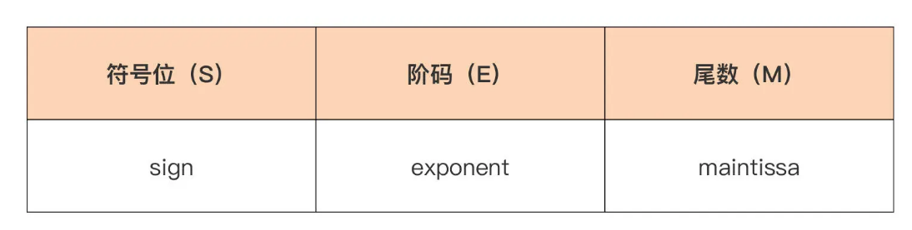

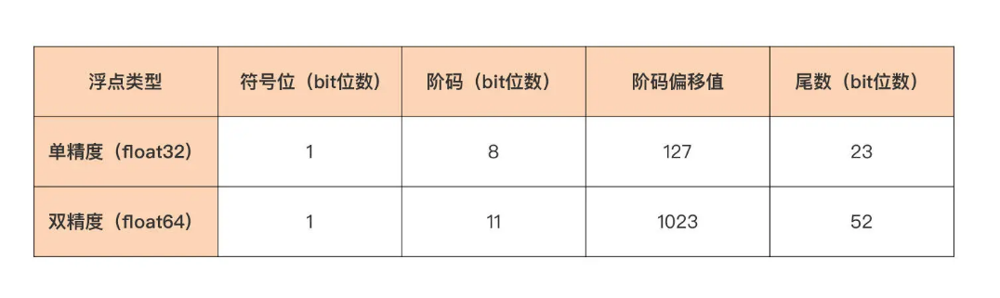

#### 转换成二进制例子

```go
有一个整数：139.8125

1.分别把整数部分和小数部分转换成二进制形式：
	整数部分：139d => 10001011b
	小数部分：0.8125d => 0.1101b（乘 2 取整）
	139.8125d=10001011.1101b
2.移动小数点直到只有一个1
	10001011.1101b => 1.00010111101b 
	移动了7位（指数7），尾数为00010111101b
3.计算阶码
	转换过程：阶码 = 指数 + 偏移值
	(偏移值计算：2^(e-1)-1，e=阶码部分的 bit 位数)
	阶码 = 7 + 127 = 134d = 10000110b
4.各自归位（见下图），得到最终二进制表示
	（尾数位数不足 23 位，可在后面补 0）
	最终浮点数 139.8125d 的二进制表示就为：
	0b_0_10000110_00010111101_000000000000
```

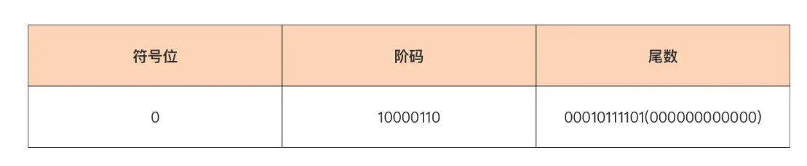


#### 字面值与格式化输出

字面值

```go
3.1415
.15  // 整数部分如果为0，整数部分可以省略不写
81.80
82. // 小数部分如果为0，小数点后的0可以省略不写

// 十进制科学计数法（e底数为10）
6674.28e-2 // 6674.28 * 10^(-2) = 66.742800
.12345E+5  // 0.12345 * 10^5 = 12345.000000

// 十六进制科学计数法（p底数为2）
0x2.p10  // 2.0 * 2^10 = 2048.000000
0x1.Fp+0 // 1.9375 * 2^0 = 1.937500
```

格式化输出

```go
fmt.Printf("%e\n", f) // 1.234568e+02		十进制科学计数法
fmt.Printf("%x\n", f) // 0x1.edd3be22e5de1p+06	十六进制科学计数法
```


### 复数类型

#### 平台无关

- complex64（实虚都为float32）
- complex128（实虚都为float64）

#### 字面值与格式化输出

```go
// 通过复数字面值初始化
var c = 5 + 6i
var d = 0o123 + .12345E+5i // 83+12345i

// complex 函数
var c = complex(5, 6) // 5 + 6i
var d = complex(0o123, .12345E+5) // 83+12345i

// 预定义函数 real 和 imag
var c = complex(5, 6) // 5 + 6i
r := real(c) // 5.000000
i := imag(c) // 6.000000
```

格式化输出：参考 float


### 自定义数值类型

#### type 关键字

基于原生数值类型

```go
// 例子：
type MyInt int32

// 类型安全规则
var m int = 5
var n int32 = 6
var a MyInt = m // 错误：在赋值中不能将m（int类型）作为MyInt类型使用
var a MyInt = n // 错误：在赋值中不能将n（int32类型）作为MyInt类型使用

// 显示转型解决上面问题
var m int = 5
var n int32 = 6
var a MyInt = MyInt(m) // ok
var a MyInt = MyInt(n) // ok
```

#### 类型别名（初衷是重构）

与type关键字可以互相替换

```go
type MyInt = int32

var n int32 = 6
var a MyInt = n // ok
```


tips：

开发生产中尽量不用浮点

tips2：

```go
// 容易混淆：
type MyInt int32	// 自定义新类型 MyInt
type MyInt = int32	// 与 int32 完全等价，可以直接相互赋值和运算
```


### 字符串类型


