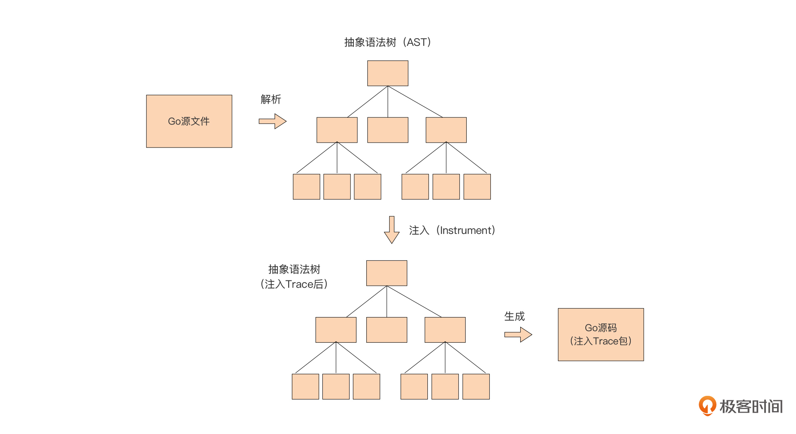

## 利用代码生成自动注入Trace函数

要实现向目标代码中的函数/方法自动注入Trace函数，我们首先要做的就是将上面Trace函数相关的代码打包到一个module中以方便其他module导入。下面我们就先来看看将Trace函数放入一个独立的module中的步骤。

### 将Trace函数放入一个独立的module中

我们创建一个名为instrument\_trace的目录，进入这个目录后，通过go mod init命令创建一个名为github.com/bigwhite/instrument\_trace的module：

```plain
$mkdir instrument_trace
$cd instrument_trace
$go mod init github.com/bigwhite/instrument_trace
go: creating new go.mod: module github.com/bigwhite/instrument_trace

```

接下来，我们将最新版的trace.go放入到该目录下，将包名改为trace，并仅保留Trace函数、Trace使用的函数以及包级变量，其他函数一律删除掉。这样，一个独立的trace包就提取完毕了。

**作为trace包的作者，我们有义务告诉大家如何使用trace包。** 在Go中，通常我们会用一个example\_test.go文件来编写使用trace包的演示代码，下面就是我们为trace包提供的example\_test.go文件：

```plain
// instrument_trace/example_test.go
package trace_test

import (
    trace "github.com/bigwhite/instrument_trace"
)

func a() {
    defer trace.Trace()()
    b()
}

func b() {
    defer trace.Trace()()
    c()
}

func c() {
    defer trace.Trace()()
    d()
}

func d() {
    defer trace.Trace()()
}

func ExampleTrace() {
    a()
    // Output:
    // g[00001]:    ->github.com/bigwhite/instrument_trace_test.a
    // g[00001]:        ->github.com/bigwhite/instrument_trace_test.b
    // g[00001]:            ->github.com/bigwhite/instrument_trace_test.c
    // g[00001]:                ->github.com/bigwhite/instrument_trace_test.d
    // g[00001]:                <-github.com/bigwhite/instrument_trace_test.d
    // g[00001]:            <-github.com/bigwhite/instrument_trace_test.c
    // g[00001]:        <-github.com/bigwhite/instrument_trace_test.b
    // g[00001]:    <-github.com/bigwhite/instrument_trace_test.a
}

```

在example\_test.go文件中，我们用ExampleXXX形式的函数表示一个示例，go test命令会扫描example\_test.go中的以Example为前缀的函数并执行这些函数。

每个ExampleXXX函数需要包含预期的输出，就像上面ExampleTrace函数尾部那样，我们在一大段注释中提供这个函数执行后的预期输出，预期输出的内容从 `// Output:` 的下一行开始。go test会将ExampleTrace的输出与预期输出对比，如果不一致，会报测试错误。从这一点，我们可以看出example\_test.go也是trace包单元测试的一部分。

现在Trace函数已经被放入到独立的包中了，接下来我们就来看看如何将它自动注入到要跟踪的函数中去。

### 自动注入Trace函数

现在，我们在instrument\_trace module下面增加一个命令行工具，这个工具可以以一个Go源文件为单位，自动向这个Go源文件中的所有函数注入Trace函数。

我们再根据 [05讲](https://time.geekbang.org/column/article/429143) 中介绍的带有可执行文件的Go项目布局，在instrument\_trace module中增加cmd/instrument目录，这个工具的main包就放在这个目录下，而真正实现自动注入Trace函数的代码呢，被我们放在了instrumenter目录下。

下面是变化后的instrument\_trace module的目录结构：

```plain
$tree ./instrument_trace -F
./instrument_trace
├── Makefile
├── cmd/
│   └── instrument/
│       └── main.go  # instrument命令行工具的main包
├── example_test.go
├── go.mod
├── go.sum
├── instrumenter/    # 自动注入逻辑的相关结构
│   ├── ast/
│   │   └── ast.go
│   └── instrumenter.go
└── trace.go

```

我们先来看一下cmd/instrument/main.go源码，然后自上而下沿着main函数的调用逻辑逐一看一下这个功能的实现。下面是main.go的源码：

```plain
//  instrument_trace/cmd/instrument/main.go

... ...

var (
    wrote bool
)

func init() {
    flag.BoolVar(&wrote, "w", false, "write result to (source) file instead of stdout")
}

func usage() {
    fmt.Println("instrument [-w] xxx.go")
    flag.PrintDefaults()
}

func main() {
    fmt.Println(os.Args)
    flag.Usage = usage
    flag.Parse() // 解析命令行参数

    if len(os.Args) < 2 { // 对命令行参数个数进行校验
        usage()
        return
    }

    var file string
    if len(os.Args) == 3 {
        file = os.Args[2]
    }

    if len(os.Args) == 2 {
        file = os.Args[1]
    }
    if filepath.Ext(file) != ".go" { // 对源文件扩展名进行校验
        usage()
        return
    }

    var ins instrumenter.Instrumenter // 声明instrumenter.Instrumenter接口类型变量

    // 创建以ast方式实现Instrumenter接口的ast.instrumenter实例
    ins = ast.New("github.com/bigwhite/instrument_trace", "trace", "Trace")
    newSrc, err := ins.Instrument(file) // 向Go源文件所有函数注入Trace函数
    if err != nil {
        panic(err)
    }

    if newSrc == nil {
        // add nothing to the source file. no change
        fmt.Printf("no trace added for %s\n", file)
        return
    }

    if !wrote {
        fmt.Println(string(newSrc))  // 将生成的新代码内容输出到stdout上
        return
    }

    // 将生成的新代码内容写回原Go源文件
    if err = ioutil.WriteFile(file, newSrc, 0666); err != nil {
        fmt.Printf("write %s error: %v\n", file, err)
        return
    }
    fmt.Printf("instrument trace for %s ok\n", file)
}

```

作为命令行工具，instrument使用标准库的flag包实现对命令行参数（这里是-w）的解析，通过os.Args获取待注入的Go源文件路径。在完成对命令行参数个数与值的校验后，instrument程序声明了一个instrumenter.Instrumenter接口类型变量ins，然后创建了一个实现了Instrumenter接口类型的ast.instrumenter类型的实例，并赋值给变量ins。

instrumenter.Instrumenter接口类型的声明放在了instrumenter/instrumenter.go中：

```plain
type Instrumenter interface {
    Instrument(string) ([]byte, error)
}

```

这里我们看到，这个接口类型的方法列表中只有一个方法Instrument，这个方法接受一个Go源文件路径，返回注入了Trace函数的新源文件内容以及一个error类型值，作为错误状态标识。我们之所以要抽象出一个接口类型，考虑的就是注入Trace函数的实现方法不一，为后续的扩展做好预留。

在这个例子中，我们默认提供了一种自动注入Trace函数的实现，那就是ast.instrumenter，它注入Trace的实现原理是这样的：



从原理图中我们可以清楚地看到，在这一实现方案中，我们先将传入的Go源码转换为 **抽象语法树**。

在计算机科学中，抽象语法树（abstract syntax tree，AST）是源代码的抽象语法结构的树状表现形式，树上的每个节点都表示源代码中的一种结构。因为Go语言是开源编程语言，所以它的抽象语法树的操作包也和语言一起开放给了Go开发人员，我们可以基于Go标准库以及 [Go实验工具库](https://golang.org/x/tools) 提供的ast相关包，快速地构建基于AST的应用，这里的ast.instrumenter就是一个应用AST的典型例子。

一旦我们通过ast相关包解析Go源码得到相应的抽象语法树后，我们便可以操作这棵语法树，并按我们的逻辑在语法树中注入我们的Trace函数，最后我们再将修改后的抽象语法树转换为Go源码，就完成了整个自动注入的工作了。

了解了原理后，我们再看一下具体的代码实现。下面是ast.instrumenter的Instructment方法的代码：

```plain
// instrument_trace/instrumenter/ast/ast.go

func (a instrumenter) Instrument(filename string) ([]byte, error) {
    fset := token.NewFileSet()
    curAST, err := parser.ParseFile(fset, filename, nil, parser.ParseComments) // 解析Go源码，得到AST
    if err != nil {
        return nil, fmt.Errorf("error parsing %s: %w", filename, err)
    }

    if !hasFuncDecl(curAST) { // 如果整个源码都不包含函数声明，则无需注入操作，直接返回。
        return nil, nil
    }

    // 在AST上添加包导入语句
    astutil.AddImport(fset, curAST, a.traceImport)

    // 向AST上的所有函数注入Trace函数
    a.addDeferTraceIntoFuncDecls(curAST)

    buf := &bytes.Buffer{}
    err = format.Node(buf, fset, curAST) // 将修改后的AST转换回Go源码
    if err != nil {
        return nil, fmt.Errorf("error formatting new code: %w", err)
    }
    return buf.Bytes(), nil // 返回转换后的Go源码
}

```

通过代码，我们看到Instrument方法的基本步骤与上面原理图大同小异。Instrument首先通过go/paser的ParserFile函数对传入的Go源文件中的源码进行解析，并得到对应的抽象语法树AST，然后向AST中导入Trace函数所在的包，并向这个AST的所有函数声明注入Trace函数调用。

实际的注入操作发生在instrumenter的addDeferTraceIntoFuncDecls方法中，我们来看一下这个方法的实现：

```plain
// instrument_trace/instrumenter/ast/ast.go

func (a instrumenter) addDeferTraceIntoFuncDecls(f *ast.File) {
    for _, decl := range f.Decls { // 遍历所有声明语句
        fd, ok := decl.(*ast.FuncDecl) // 类型断言：是否为函数声明
        if ok {
            // 如果是函数声明，则注入跟踪设施
            a.addDeferStmt(fd)
        }
    }
}

```

这个方法的逻辑十分清晰，就是遍历语法树上所有声明语句，如果是函数声明，就调用instrumenter的addDeferStmt方法进行注入，如果不是，就直接返回。addDeferStmt方法的实现如下：

```plain
// instrument_trace/instrumenter/ast/ast.go

func (a instrumenter) addDeferStmt(fd *ast.FuncDecl) (added bool) {
    stmts := fd.Body.List

    // 判断"defer trace.Trace()()"语句是否已经存在
    for _, stmt := range stmts {
        ds, ok := stmt.(*ast.DeferStmt)
        if !ok {
            // 如果不是defer语句，则继续for循环
            continue
        }

        // 如果是defer语句，则要进一步判断是否是defer trace.Trace()()
        ce, ok := ds.Call.Fun.(*ast.CallExpr)
        if !ok {
            continue
        }

        se, ok := ce.Fun.(*ast.SelectorExpr)
        if !ok {
            continue
        }

        x, ok := se.X.(*ast.Ident)
        if !ok {
            continue
        }
        if (x.Name == a.tracePkg) && (se.Sel.Name == a.traceFunc) {
            // defer trace.Trace()()已存在，返回
            return false
        }
    }

    // 没有找到"defer trace.Trace()()"，注入一个新的跟踪语句
    // 在AST上构造一个defer trace.Trace()()
    ds := &ast.DeferStmt{
        Call: &ast.CallExpr{
            Fun: &ast.CallExpr{
                Fun: &ast.SelectorExpr{
                    X: &ast.Ident{
                        Name: a.tracePkg,
                    },
                    Sel: &ast.Ident{
                        Name: a.traceFunc,
                    },
                },
            },
        },
    }

    newList := make([]ast.Stmt, len(stmts)+1)
    copy(newList[1:], stmts)
    newList[0] = ds // 注入新构造的defer语句
    fd.Body.List = newList
    return true
}

```

虽然addDeferStmt函数体略长，但逻辑也很清晰，就是先判断函数是否已经注入了Trace，如果有，则略过；如果没有，就构造一个Trace语句节点，并将它插入到AST中。

Instrument的最后一步就是将注入Trace后的AST重新转换为Go代码，这就是我们期望得到的带有Trace特性的Go代码了。

### 利用instrument工具注入跟踪代码

有了instrument工具后，我们再来看看如何使用这个工具，在目标Go源文件中自动注入跟踪设施。

这里，我在instrument\_trace项目的examples目录下建立了一个名为demo的项目，我们就来看看如何使用instrument工具为demo项目下的demo.go文件自动注入跟踪设施。demo.go文件内容很简单：

```plain
// instrument_trace/examples/demo/demo.go

package main

func foo() {
    bar()
}

func bar() {
}

func main() {
    foo()
}

```

我们首先构建一下instrument\_trace下的instrument工具：

```plain
$cd instrument_trace
$go build github.com/bigwhite/instrument_trace/cmd/instrument
$instrument version
[instrument version]
instrument [-w] xxx.go
  -w	write result to (source) file instead of stdout

```

接下来，我们使用instrument工具向examples/demo/demo.go源文件中的函数自动注入跟踪设施：

```plain
$instrument -w  examples/demo/demo.go
[instrument -w examples/demo/demo.go]
instrument trace for examples/demo/demo.go ok

```

注入后的demo.go文件变为了下面这个样子：

```plain
// instrument_trace/examples/demo/demo.go

package main

import "github.com/bigwhite/instrument_trace"

func foo() {
    defer trace.Trace()()
    bar()
}

func bar() {
    defer trace.Trace()()
}

func main() {
    defer trace.Trace()()
    foo()
}

```

此时，如果我们再对已注入Trace函数的demo.go执行一次instrument命令，由于instrument会判断demo.go各个函数已经注入了Trace，demo.go的内容将保持不变。

由于github.com/bigwhite/instrument\_trace并没有真正上传到github.com上，所以如果你要运行demo.go，我们可以为它配置一个下面这样的go.mod：

```plain
// instrument_trace/examples/demo/go.mod

module demo

go 1.17

require github.com/bigwhite/instrument_trace v1.0.0

replace github.com/bigwhite/instrument_trace v1.0.0 => ../../

```

这样运行demo.go就不会遇到障碍了：

```plain
$go run demo.go
g[00001]:    ->main.main
g[00001]:        ->main.foo
g[00001]:            ->main.bar
g[00001]:            <-main.bar
g[00001]:        <-main.foo
g[00001]:    <-main.main

```

## 小结

到这里，我们已经实现了这节课开始时设定的目标：实现一个自动注入跟踪代码并输出有层次感的函数调用链跟踪命令行工具。

回顾一下这个工具的实现思路：我们先基于defer实现了一个最简单的函数跟踪机制，然后针对这个最简单的实现提出若干问题，接下来我们逐一把这些问题解决掉了，最终将第一版相对粗糙的代码实现演进重构为一个相对完善的命令行工具。

关于这个实战项目，有两点注意事项要和你交代清楚：

第一，在代码中注入函数调用跟踪代码仅适用于日常调试代码和阅读理解代码时使用，被注入了跟踪设施的代码是不适合上生产环境的；

第二，我在这里使用到了Go核心团队不推荐使用的Goroutine id，这也是由这个实战项目的性质所决定的。如果你的代码是上生产，我建议还是尽量听从Go核心团队的建议， **不要依赖Goroutine ID**。

## 思考题

通过instrument命令行工具对Go源文件进行注入后，defer trace.Trace()()就会成为Go源码的一部分被编译进最终的可执行文件中。我们在小结中也提到了，开启了Trace的代码不要上生产环境，这样我们在构建上生产的应用之前需要手工删掉这些Trace代码，操作起来十分繁琐易错。

所以，这里我想请你为Trace增加一个开关功能，有了这个开关后，日常开发调试过程中编译出的程序中的Trace是起作用的，但为生产环境编译出的可执行程序中虽然也包含Trace，但Trace不会真正起作用（提示：使用build tag）。


A：  trace.go 有两个版本（文件名可以分别为 dev_trace.go， prod_trace.go），dev 版本的trace 是正常的打印逻辑，prod 版本直接返回空函数体