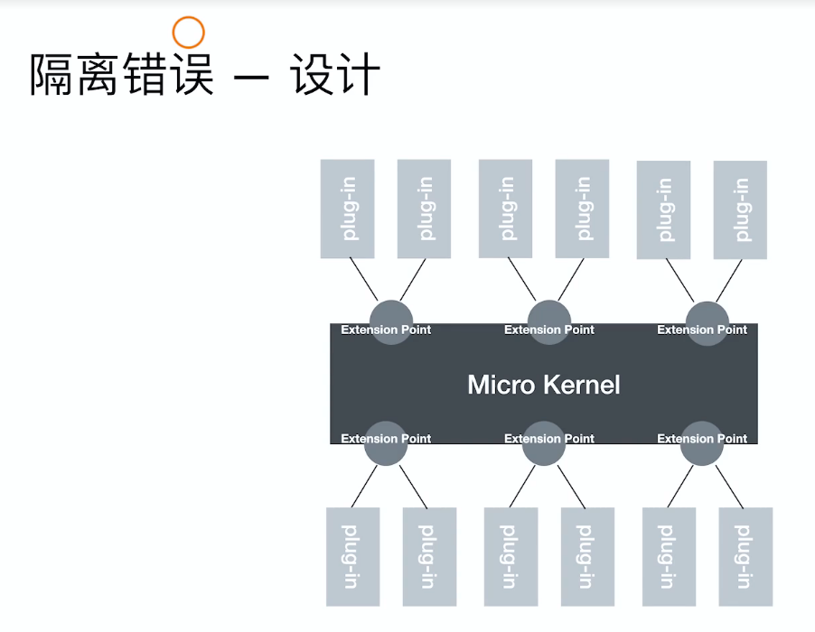
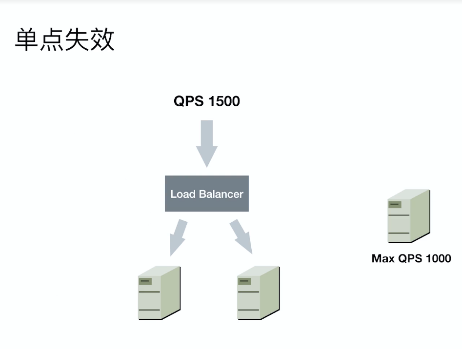
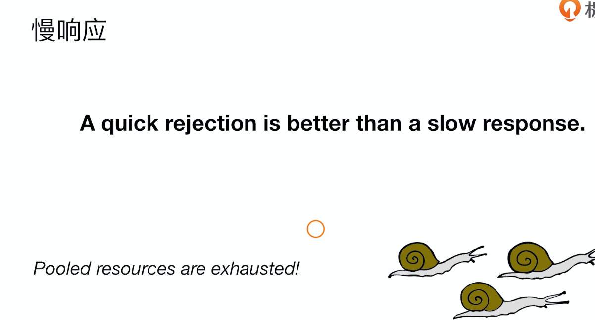
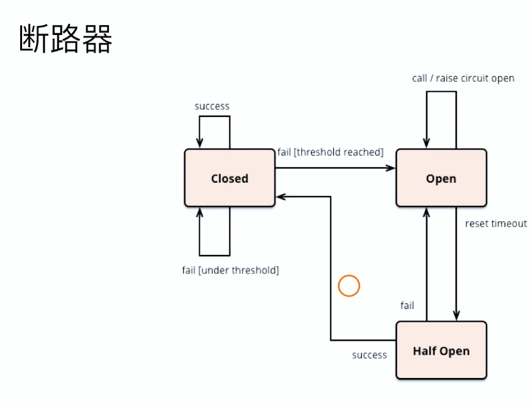
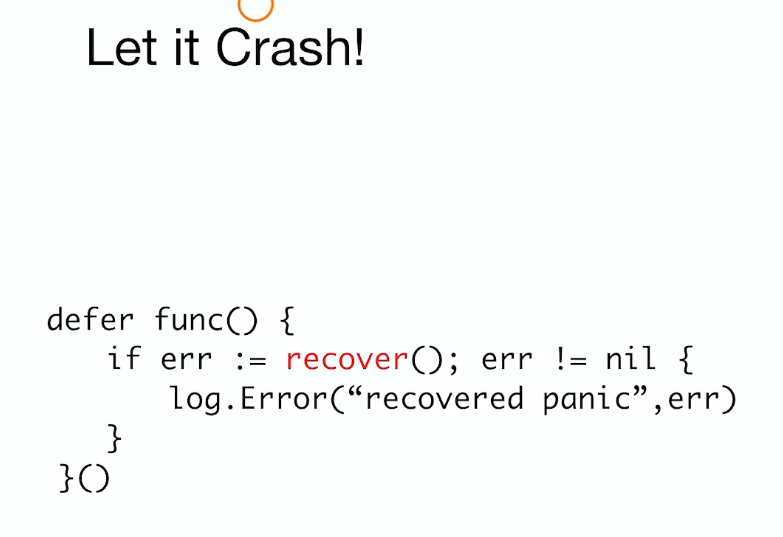
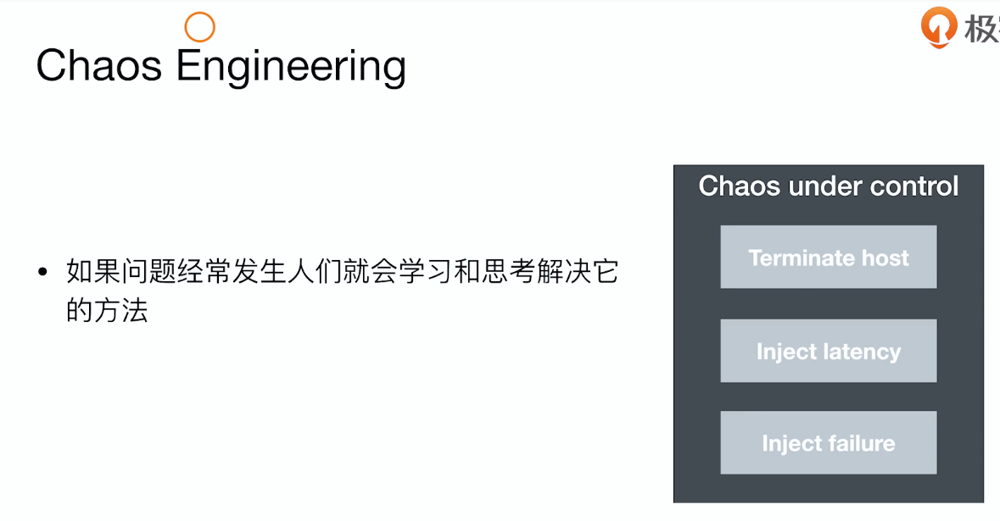
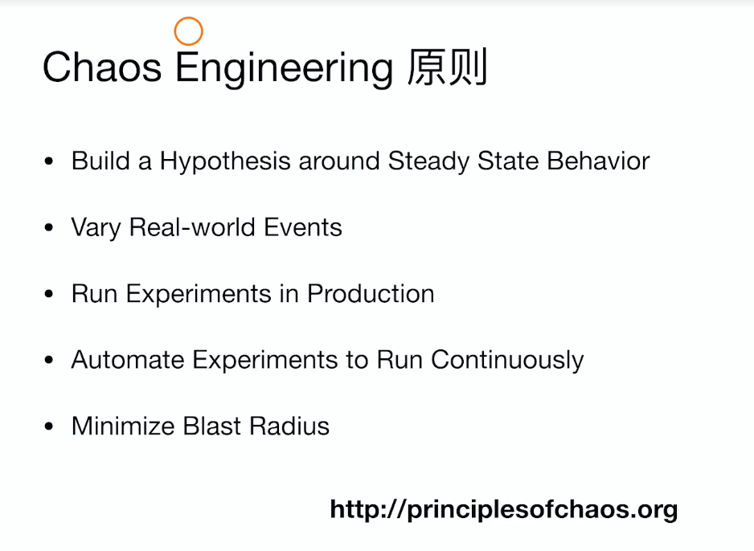

# 高可用

## 字符串连接


`fmt.Sprintf` > `string +=` > `bytes.Buffer.WriteString` > `strings.Builder.WriteString`


## 面向错误的设计

首先接受系统会错误的事实

- 隔离




- 冗余




- 限流





- 断路器





## 面向恢复的设计

预知所有失败是不可能的





## Chaos Engineering





```md
- 稳定系统的表现行为
- 尝试真实的问题
- 尝试真实的产品
- 自动化、持续
- 范围可控
```


## 结束


